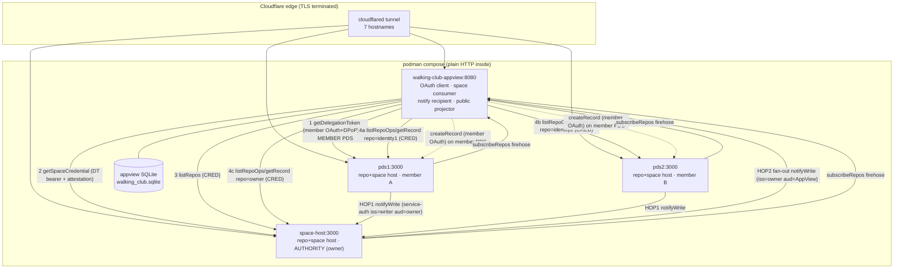

# Permissioned-Data Spaces (0016) Test Cluster — Implementation Plan

**Target:** a working, locally-run, publicly-reachable test cluster on base domain `ngerakines.dev` that exercises the AT Protocol **proposal-0016 permissioned-data flows** end-to-end, built from the `atproto-crates` `pds` binary plus a **new `walking-club-appview`**, run via **podman + docker-compose**, and exposed through **Cloudflare Tunnels** across **seven hostnames**.

> Status flag, read this first: 0016 is a **draft**, and this implementation provides **access control, not confidentiality**. Records in a space are protected by *who can mint a credential*, not by encryption — the space host stores plaintext and a leaked credential reads the space. The deniable-commit + LtHash machinery gives **non-transferable authenticity** (you cannot prove to a third party what a member committed), not secrecy. Treat the whole thing as a testbed, never as a vault. The known-gaps section (Part 7) enumerates every place the implementation is narrower than the prompt or the spec implies.

---

## Part 1 — Executive summary + role mapping

### 1.1 What we are building

The walking club is a members-only group. Members keep their walk events and posts in **permissioned-data spaces**: each member writes into their *own* per-space repo on their *own* PDS, and the space *authority* (the club-owner account) defines who is a member and therefore whose writes count. A consumer — our new `walking-club-appview` — reads the *unified* members-only view by minting a short-lived **space credential** and pulling every member-repo across both PDS hosts, verifying each writer's **deniable commit** and reconciling its **LtHash** before rendering.

There are three kinds of action, matching the blog's three categories:

- **MANAGEMENT** — owner-only space lifecycle: create the space, add/remove members, set the mint policy and app-access policy (`com.atproto.simplespace.*`).
- **WRITE** — a member writes into their own permissioned repo (`com.atproto.space.createRecord` / `putRecord` / `applyWrites`), author-attributed via OAuth, never via a credential.
- **READ / NOTIFY** — a consumer mints a credential through the three-token flow and pulls the space (`com.atproto.space.getDelegationToken` → `getSpaceCredential` → `listRepos` / `getRepoState` / `listRepoOps` / `getRecord` / `listRecords`), and stays live via `registerNotify` + an inbound `notifyWrite` webhook.

### 1.2 The key architectural fact

**There is no separate "space host" mode.** Every `pds` binary is *simultaneously* a repo host (`com.atproto.repo.*`, `com.atproto.sync.*`) and an always-on space host (`com.atproto.simplespace.*`, `com.atproto.space.*`). The Spaces stack (`SpaceService`/`SpaceWriter`/`SpaceReader`/`SpaceSync`) is wired unconditionally in `pds.rs:447-461`, and every account's PLC genesis bakes in `#atproto_space` (verification method, coincident with `#atproto`) and `#atproto_space_host` (service, coincident with `#atproto_pds`) per 0016 line-92's MAY-coincide allowance (`plc.rs:159-203`). Consequences that shape the whole plan:

- The hostname `space-host.ngerakines.dev` is just a **third ordinary PDS** that we *name* for the role it plays (it hosts the club-owner authority account). It is the same image as `pds1`/`pds2`, distinct config + volume.
- **No `atpdid plc update` is needed** to inject `#atproto_space`/`#atproto_space_host` for PDS-issued accounts — genesis does it. Step 4 of the bootstrap is verify-only for the default topology.

### 1.3 Blog roles → the seven `ngerakines.dev` hostnames

| # | Hostname | Blog role it plays | Backed by | Local target | Reached via tunnel? |
|---|---|---|---|---|---|
| 1 | `walking-club-appview.ngerakines.dev` | The **consumer / AppView** (reader + writer-helper + notify recipient; confidential OAuth client) | new `walking-club-appview` container | `appview:8080` | yes (HTTP) |
| 2 | `pds1.ngerakines.dev` | **Repo host + space host** for member A (`identity1`) | `pds` instance #1 | `pds1:3000` | yes (HTTP + WS) |
| 3 | `pds2.ngerakines.dev` | **Repo host + space host** for member B (`identity2`) | `pds` instance #2 | `pds2:3000` | yes (HTTP + WS) |
| 4 | `space-host.ngerakines.dev` | **Space authority host** — runs the club-owner/authority account (`identity3`); the `#atproto_space_host` endpoint resolved for the space | `pds` instance #3 (identical binary) | `space-host:3000` | yes (HTTP + WS) |
| 5 | `identity1.ngerakines.dev` | **Handle** for member A's account (whose repo lives on pds1) | DNS TXT `_atproto.identity1` only | — (no container) | no — DNS TXT only |
| 6 | `identity2.ngerakines.dev` | **Handle** for member B's account (whose repo lives on pds2) | DNS TXT `_atproto.identity2` only | — | no — DNS TXT only |
| 7 | `identity3.ngerakines.dev` | **Handle** for the authority/owner account (whose repo lives on space-host) | DNS TXT `_atproto.identity3` only | — | no — DNS TXT only |

A **fourth account** — `nonmember.ngerakines.dev`, also on `space-host` — exists to prove the negative cases. It needs no dedicated tunnel hostname (it reuses the seven above; its handle TXT is optional).

> Naming reconciliation across the research: the bootstrap design uses `pds3` as the authority host and calls `space-host.ngerakines.dev` a CNAME/tunnel to it; the devops design runs a distinct `space-host` container. **This plan adopts the distinct-container form** (`space-host` = the third PDS, `did:web:space-host.ngerakines.dev`), and the authority account `identity3` is created on it. Wherever the research said "pds3", read "space-host". `identity3`'s genesis therefore points `#atproto_space_host` at `https://space-host.ngerakines.dev` automatically — exactly what we want, so Step 4 stays verify-only.

---

## Part 2 — Architecture overview

### 2.1 Components and who hosts what

| Component | Process / image | Public hostname | Plane |
|---|---|---|---|
| PDS #1 (member A repo + space host) | `atproto-pds:dev` | `pds1.ngerakines.dev` | both |
| PDS #2 (member B repo + space host) | `atproto-pds:dev` | `pds2.ngerakines.dev` | both |
| Space authority host (owner repo + space host) | `atproto-pds:dev` | `space-host.ngerakines.dev` | both |
| Walking-Club AppView | `walking-club-appview:dev` | `walking-club-appview.ngerakines.dev` | both (consumer of permissioned, projector of public); embeds its own SQLite DB — no Postgres, no Redis |
| cloudflared | `cloudflare/cloudflared` | (all 7 hostnames) | edge |

> Public-plane indexing runs **inside** the AppView (a per-PDS `com.atproto.sync.subscribeRepos` consumer), so there is no ramjet/relay service. See §2.2 and §3.8.

### 2.2 The two planes

- **Public plane** — normal AT Protocol repos. Members also publish *public* versions of events/posts (`com.atproto.repo.createRecord`) into their ordinary repos. These flow over each PDS's `com.atproto.sync.subscribeRepos` firehose. The AppView indexes them with a **built-in per-PDS firehose consumer** — one WS connection straight to each PDS's `subscribeRepos`, decoded in-process (no ramjet, no relay; recommended for a small fixed cluster) — and projects into a `public_records` table.
- **Permissioned plane** — the 0016 space. **There is no firehose here.** The members-only records live in per-(member, space) repos and are reachable only by presenting a space credential to the space host. The AppView pulls this plane via the three-token flow and stays live via `notifyWrite`. It projects into `events` / `posts`.

The two planes are kept cleanly separate: direct `subscribeRepos` → public projection; three-token flow + notify → members-only projection. The feed view reads the perimeter-gated members-only projection; a public landing page can read the public projection.

### 2.3 The three tokens (read flow)

| Token | `typ` | `kid` | Signed by | `aud` | TTL | Who presents it |
|---|---|---|---|---|---|---|
| **Delegation token (DT)** | `atproto-space-delegation+jwt` | `#atproto` | member's `#atproto` key | `<spaceDid>#atproto_space_host` | 60s | minted by **member's own PDS** from member OAuth (`client_id` + whole-space `read` scope required) |
| **Client attestation** | `atproto-client-attestation+jwt` | AppView JWKS `kid` | AppView OAuth private key (ES256) | `<spaceDid>#atproto_space_host` | ≤300s (we use 120s) | AppView, in the `getSpaceCredential` body |
| **Space credential (CRED)** | `atproto-space-credential+jwt` | `#atproto_space` | authority's `#atproto_space` key (== `#atproto`) | **none** | 7200s (2h) | minted by space host; bearer for `listRepos`/`registerNotify` (authority host) **and** per-writer reads (each writer's own repo host) |

Flow: member OAuth → `getDelegationToken` on the **member's PDS** (DT, 60s, signed by the member's `#atproto` key, presented as `Authorization: Bearer` to the next call) → `getSpaceCredential` on the **space host** (DT *is* the auth; attestation in body) → CRED (2h, no `aud`, whole-space read). Minting the credential **self-registers** the AppView as a notify recipient.

> Endpoint note (which host serves what): `getDelegationToken` is signed by the *member's* `#atproto` key, so it MUST be called on the *member's own PDS* (e.g. `pds1` for `identity1`), not on the space host. **Space-level** methods — `getSpaceCredential`, `listRepos`, `registerNotify`, `getSpace` — target the **authority host** (the space owner's `#atproto_space_host`, i.e. `space-host`). **Per-writer record reads** — `getRepoState` / `listRepoOps` / `getRecord` / `listRecords` / `getBlob` — read the writer's *local* per-actor store, so each MUST be sent to **that writer's own repo host** (resolve the writer DID's `#atproto_pds`: `identity1`→`pds1`, `identity2`→`pds2`, owner `identity3`→`space-host`). There is **no proxying**: `getRecord?repo=$DID2` against `space-host` returns 404, because `space-host` holds only contentless `notifyWrite` receipts for `identity2`, not its records (`reader.rs:101`, `sync.rs:14-15`).

### 2.4 Diagram



> Diagram note: step 1 (`getDelegationToken`) hits the member's own PDS (`P1` for member A; `P2` for member B). Steps 2–3 (`getSpaceCredential`, `listRepos`) and `registerNotify` hit the authority host (`SH`). Step 4 is a **direct, partitioned pull**: the AppView resolves each writer DID to its `#atproto_pds` and pulls that writer's repo *from that host* with the no-`aud` credential (every repo host verifies it against the authority's published `#atproto_space` key, no call back to `SH`) — `identity1` from `P1`, `identity2` from `P2`, the owner from `SH`. There is no relay and no proxy through `SH`.

---

## Part 3 — The `walking-club-appview`

### 3.1 What it is

A new **single-crate Rust + axum** web app served at `https://walking-club-appview.ngerakines.dev`. Two jobs:

1. A **confidential backend-for-frontend OAuth client** (BFF) for member login — `private_key_jwt` + DPoP + PKCE + PAR, modeled on june-bug's modular OAuth split and lexicon-garden's `WebContext`/cookie/minijinja skeleton.
2. A **0016 space consumer / writer-helper / notify recipient** — the new "space delta" module built on `atproto-space`.

It clones lexicon-garden's skeleton (axum + `WebContext(Arc<...>)` + `FromRef`, minijinja with `reload`/`embed` for server-rendered HTML, the middleware stack), **strips** all lexicon-schema/analytics/MCP/DNSimple domain code **and the Vite/npm frontend build + Postgres + Redis**, **swaps storage** to a single embedded SQLite database, **keeps** a firehose indexer (re-pointed from a relay to a direct per-PDS `subscribeRepos` consumer), and **adds** the space module.

> Frontend (deliberately minimal — **no build step**): pure server-rendered **minijinja HTML templates** in `templates/`, embedded into the release binary via `minijinja-embed` (so the runtime image carries no loose template files) with autoreload from disk in dev. Styling is a single hand-written `static/app.css` (optionally a vendored Pico CSS file copied in, not built) served by `ServeDir`. **No Vite, no npm, no TypeScript, no bundler, no `src-js/`.** Pages render fully server-side; the only client JS is a few lines of inline vanilla `setInterval` that re-fetches the `/feed/fragment` HTML to stay live. htmx-from-a-CDN can be dropped in later (still no build) if richer interactivity is wanted.

> URI-handling correction (carry it through): space URIs and per-record URIs use the **`ats://`** scheme, not `at://`. Parse and `format!` them with `atproto_space::types::{SpaceUri, RecordUri, ATS_SCHEME}` — **never** `atproto_record::aturi::ATURI`, which only accepts `at://` and rejects every space URI. `atproto-record` is kept only for public-plane `at://` URIs and TID generation.

### 3.2 OAuth client identity

`client_id` **is** the metadata URL. The same JWKS that backs `private_key_jwt` token-endpoint auth also signs the **client attestation** in the read flow, so it is published at a `jwks_uri` (by URL, not inline) because the space host fetches it by URL during attestation verification.

`GET /client-metadata.json`:

```json
{
  "client_id": "https://walking-club-appview.ngerakines.dev/client-metadata.json",
  "client_name": "Walking Club AppView",
  "client_uri": "https://walking-club-appview.ngerakines.dev",
  "application_type": "web",
  "grant_types": ["authorization_code", "refresh_token"],
  "response_types": ["code"],
  "redirect_uris": ["https://walking-club-appview.ngerakines.dev/callback"],
  "scope": "atproto transition:generic space:city.thegem.walkingclub.space?action=read space:city.thegem.walkingclub.space?action=create&collection=community.lexicon.calendar.event space:city.thegem.walkingclub.space?action=create&collection=app.bsky.feed.post",
  "token_endpoint_auth_method": "private_key_jwt",
  "token_endpoint_auth_signing_alg": "ES256",
  "dpop_bound_access_tokens": true,
  "jwks_uri": "https://walking-club-appview.ngerakines.dev/jwks.json"
}
```

Scope grammar, consistent with the implemented gates: the positional segment right after `space:` is ALWAYS the space-TYPE NSID (`city.thegem.walkingclub.space`); the action and `manage` verbs live in the query string, never positionally.
- `space:city.thegem.walkingclub.space?action=read` — whole-space read; this is what satisfies `assert_space_scope(Read)` in `getDelegationToken` (`space_handlers.rs:1442`, the `Read` gate). **`read_self` does NOT satisfy it** (the `:1442` gate requires `Read`, which `ReadSelf` does not confer; `:1432` is the separate app-password/`client_id`-presence check), and `read` already implies `read_self`, so we request `action=read` and omit `read_self`.
- `space:city.thegem.walkingclub.space?action=create&collection=…` — one grant per write collection, matching `assert_space_scope(Create, collection)` (`:738`). Two collections: `community.lexicon.calendar.event` and `app.bsky.feed.post`.
- `space:city.thegem.walkingclub.space?manage=update` — **omit** for a pure member/consumer client. Only add it (owner-operated only) if the AppView is run by the owner and performs `simplespace.addMember`/`removeMember` on the owner's behalf. Never write bare `space:manage`; `manage` is a query verb.

`GET /jwks.json` publishes **public** keys only (private keys live in `OAUTH_PRIVATE_KEYS` env, never served). First key = current signer for both `private_key_jwt` and the client attestation; the rest are historical for rotation. Each `kid` is stable and must match the `kid` the attestation header carries, because the host selects the JWK by `kid` (`mint_authz.rs`).

`GET /.well-known/did.json` serves a `did:web` doc for the service itself (`WalkingClubAppViewService`), independent of the OAuth JWKS. **This `did:web` document MUST carry an `AtprotoPersonalDataServer` service entry**, and the AppView MUST also serve `GET /.well-known/atproto-did` returning its `did:web` DID as `text/plain` (see §3.3). Together these let the owner's recipient resolution (`https://<client_id host>/.well-known/atproto-did` → the `did:web` doc → its `AtprotoPersonalDataServer` service) yield the **AppView DID** for the HOP-2 notify `aud`. Without them, recipient resolution falls back to a stub keyed on the member DID (or the `client_id` URL on explicit `registerNotify`), and the AppView's inbound `aud == its own did:web DID` check would reject every fan-out. The inbound `notifyWrite` handler verifies `aud` against this same `did:web` DID.

### 3.3 Routes

| Method | Path | Handler | Auth | Notes |
|---|---|---|---|---|
| GET | `/` | `handle_index` | public | landing / login prompt |
| GET | `/client-metadata.json` | `oauth::metadata::client_metadata` | public, CORS | `client_id` doc (§3.2) |
| GET | `/jwks.json` | `oauth::metadata::jwks` | public, CORS | public JWKS (also signs attestation) |
| GET | `/.well-known/did.json` | `handle_did` | public | `did:web` doc for this service; **carries an `AtprotoPersonalDataServer` service** so recipient resolution yields the AppView DID (§3.2) |
| GET | `/.well-known/atproto-did` | `handle_atproto_did` | public | returns the AppView's `did:web` DID as `text/plain`; the owner fetches this during notify-recipient resolution (§3.2, §3.6) |
| POST | `/login` | `oauth::login::init` | public, CSRF | PKCE + PAR init → redirect to authz endpoint |
| GET | `/callback` | `oauth::callback::callback` | public | code→token exchange, set cookies |
| POST | `/auth/refresh` | `oauth::refresh::refresh` | session, CSRF | re-mint session cookie if <5min |
| POST | `/auth/logout` | `oauth::logout::logout` | session, CSRF | clears both cookies |
| GET | `/feed` | `handle_feed::feed_view` | session (member) | members-only READ view (§3.5) |
| GET | `/feed/fragment` | `handle_feed::feed_fragment` | session (member) | server-rendered HTML fragment for the optional inline-JS live poll (no JSON API) |
| GET | `/compose` | `handle_compose::compose_view` | session | server-rendered compose form |
| POST | `/api/compose/event` | `handle_compose::create_event` | session, CSRF | WRITE `community.lexicon.calendar.event` (§3.4) |
| POST | `/api/compose/post` | `handle_compose::create_post` | session, CSRF | WRITE `app.bsky.feed.post` (§3.4) |
| POST | `/xrpc/com.atproto.space.notifyWrite` | `handle_notify::notify_write` | **service auth** | inbound forwarded notify (§3.6) |
| GET | `/_alive` `/_ready` `/metrics` | `health::*` | public | liveness / readiness (SQLite WAL; multiple concurrent logical writers serialized by WAL + `busy_timeout`) / prometheus |
| — | `/static/*` | `ServeDir` | public | hand-written `app.css` + favicons (no bundle) |
| GET | `/admin`, `/admin/…` | `handle_admin` | admin basic-auth + CSRF | force resync, view writer set |

`build_router(WebContext) -> IntoMakeServiceWithConnectInfo<Router, SocketAddr>`, sub-routers merged with layered middleware (lexicon-garden's exact shape): outermost `TraceLayer` → health routes (added after trace, stay quiet) → `MetricsLayer` → `RequestFilterLayer` → `TimeoutLayer(30s)` → global CSRF cookie middleware → `.with_state(WebContext)` → `.into_make_service_with_connect_info::<SocketAddr>()` (needed so rate-limit can read the client IP). The inbound `notifyWrite` route lives under the `xrpc_rate_limited` sub-router (jti-replay → rate-limit → CORS) since it is a public-internet XRPC endpoint.

### 3.4 WRITE implementation — `space.createRecord` on the member PDS with the OAuth token

A member composing in `/compose` writes into **their own permissioned repo within the space**, on **their own PDS**, authorized by **their OAuth+DPoP access token** (writes are author-attributed; the credential is never used for writes — `require_repo_matches_subject`, `space_handlers.rs:857`).

`handle_compose::create_event`:

```rust
// 1. Decrypt session cookie -> SessionCookie { did, access_token, refresh_token, dpop_private_key, ... }
let session = get_authenticated_session(&headers, &ctx.cookie_secret)?;
try_refresh_session(&ctx, &session, Duration::minutes(5)).await?;   // june-bug helper

// 2. Resolve the member's PDS (their space-host endpoint == their #atproto_pds endpoint)
let doc = ctx.identity_resolver.resolve(&session.did).await?;
let pds_url = doc.pds_endpoints().first().cloned().ok_or(AppError::NoPdsEndpoint)?;

// 3. Rebuild DPoP key from the cookie; build DPoP auth
let dpop_key = identify_key(&session.dpop_private_key)?;
let auth = Auth::DPoP(DPoPAuth {
    dpop_private_key_data: dpop_key,
    oauth_access_token: session.access_token.clone(),
});

// 4. Build the record (rkey omitted -> host auto-TIDs)
let record = json!({
    "$type": "community.lexicon.calendar.event",
    "name": form.name,
    "createdAt": now_iso(),
});

// 5. POST com.atproto.space.createRecord on the member's space-host (== their PDS).
//    atproto-client has NO com::atproto::space module — createRecord is server-side
//    only — so POST raw to {pds}/xrpc/com.atproto.space.createRecord with DPoP auth
//    and a JSON body matching CreateRecordInput{space,repo,collection,rkey?,validate?,record}.
//    space_uri is parsed/formatted via atproto_space::types::SpaceUri (ats:// scheme),
//    NOT atproto_record::aturi::ATURI.
let input = json!({
    "space":      ctx.config.space_uri.to_string(),   // ats://<ownerDid>/<type>/<skey>  (SpaceUri)
    "repo":       session.did.clone(),                // MUST equal subject
    "collection": "community.lexicon.calendar.event",
    // "rkey" omitted -> host auto-TIDs
    "validate":   true,
    "record":     record,
});
let resp = post_xrpc(                                  // raw DPoP POST helper (builds the DPoP proof from `auth`)
    &ctx.http, &auth, &pds_url,
    "com.atproto.space.createRecord",
    &input,
).await?;   // -> { uri, cid, validationStatus? }  ONLY (no rev, no setHash); uri is a 6-segment ats:// RecordUri.
             //    For rev + the signed commit, call getRepoState separately (only applyWrites returns SpaceCommitResult).
```

On commit, the member's PDS advances `rev` (fresh TID), updates the LtHash set (`add(element)` where `element = "{collection}/{rkey}/{cid}"`), re-signs a deniable commit, and **fires `notifyWrite`** (HOP 1, writer-PDS → owner). The owner then fans out (HOP 2) to us. So our write closes the loop and triggers our own re-index. `app.bsky.feed.post` is written identically with the other collection. OAuth 401/expired → re-run `try_refresh_session`; if refresh fails, clear cookies, redirect to `/login`.

### 3.5 READ implementation — full delegation→credential→pull→verify→render

`handle_feed::feed_view` orchestrates `space::reader::build_feed(space_uri, &session)`. All space/record URIs are parsed and rebuilt with `atproto_space::types::{SpaceUri, RecordUri}` (the `ats://` scheme), never `atproto_record::aturi::ATURI`.

- **Step A — getDelegationToken (member's own PDS, OAuth+DPoP).** Resolve the member's `#atproto_pds` endpoint, then `GET com.atproto.space.getDelegationToken?space=<ats>` against **that member PDS** (e.g. `pds1` for `identity1`) with `Auth::DPoP(member access_token)` → `{token}`. The DT is signed by the member's `#atproto` key, so it must be minted by the member's own PDS — not the space host. 60s TTL, never cached.
- **Step B — client attestation (local).** `space::attestation::mint(space_did)` — ES256 JWS over the AppView JWKS (§3.7), `aud=<spaceDid>#atproto_space_host`.
- **Step C — getSpaceCredential (space host).** `POST com.atproto.space.getSpaceCredential` on the **space host** with `Authorization: Bearer <DT>` and body `{space, clientAttestation}`. Host verifies DT, single-use `jti`, attestation → `client_id`, USER axis (member-list: must be in `space_member`) + APP axis (`#open` ⇒ attestation optional; `#allowList` ⇒ our `client_id` allow-listed), mints CRED, **self-registers us as a whole-space recipient** (`repo=NULL`). Cache in SQLite `space_credential_cache` (PK `(space, member_did)`) with `expires_at = now + min(exp-now, 7200) - 120s`; treat it as a cache (re-mint on miss/expiry).
- **Step D — listRepos (space host, credential-only).** `GET com.atproto.space.listRepos?space=<ats>` with `Authorization: Bearer <CRED>` (OAuth rejected 401 here) → `{repos:[{did, rev}]}`. This writer set = `DISTINCT issuer_did, MAX(rev)` over the owner host's `space_received_op`. Persist to `writers`.
- **Step E — direct per-writer pull from each repo host (pds1 AND pds2 AND space-host).** For each `{did, rev}` from `listRepos`, resolve the writer's `#atproto_pds` endpoint (`atproto-identity`; `identity1`→`pds1`, `identity2`→`pds2`, owner `identity3`→`space-host`; persist it in `writers.pds_host`) and call `getRepoState` (→ `#signedCommit`), `listRepoOps?since=<rev>__<idx>` (incremental), and `getRecord` per op **on that writer's own repo host** — never on the authority host, which holds no copy of another member's records (`reader.rs:101` reads the *local* per-actor store of `repo`; `sync.rs:14-15`). Present the no-`aud` CRED as `Authorization: Bearer` with explicit `repo=<did>`; the repo host verifies it against the authority's published `#atproto_space` key without calling back to space-host. Parse the returned `ats://` record URIs with `RecordUri`.
- **Step F — verify deniable commit + reconcile LtHash** (`space::verify` via `atproto-space`):
  1. resolve writer `#atproto` key;
  2. `verify_commit(SpaceContext{space, rev}, commit)` — recompute `ctx` via `atproto_space::commit::encode_ctx` = `"atproto-space-v1"` (DOMAIN_PREFIX, **not** length-prefixed) followed by per-field `uint16be(len)||value` framing of `space_uri`, `rev`, `ikm`; recompute HMAC over `commit.hash`, constant-time compare (catches tamper / wrong space / wrong rev);
  3. `verify_commit_signature(SpaceContext{space, rev}, &commit, &writer_key)` — pass the `SpaceContext` (it rebuilds `ctx` internally via `encode_ctx`); ECDSA over **`ctx` only**, never over `hash` (deniability) → authenticity;
  4. reconcile — rebuild an `LtHash` from the pulled live `(collection, rkey, cid)` ops (`element = "{collection}/{rkey}/{cid}"`, lane-wise add) and confirm `LtHash::digest` (= `sha256(2048-byte state)`) equals `commit.hash`. **Encoding caution:** the read-side commit byte fields — `commit.{hash,mac,ikm,sig}` from `getRepoState`/`listRepoOps` — are atproto lex-bytes `{"$bytes":"<base64 standard alphabet, UNPADDED>"}`, **not** hex; base64-decode them (`STANDARD_NO_PAD`) before HMAC/sig/hash verification. The `setHash` returned by `getRepoState` (and in `SpaceCommitResult` — **not** by `createRecord`) is hex of the **full 2048-byte LtHash state** (4096 hex chars; empty repo = `"0"`*4096), not a 64-char digest. So reconcile as `LtHash::from_state_bytes(hex_decode(setHash)).digest() == base64_decode(commit.hash)` (i.e. `sha256(hex_decode(setHash)) == base64_decode(commit.hash)`) — never a hex-to-hex `setHash == commit.hash` compare. Mismatch ⇒ reject that writer's batch, log `error-walking-club-appview-verify-1`, **do not advance its cursor**. `op.cid` is a base32 CID string (CIDv1/dag-cbor `0x71`/sha2-256), not a byte/hex field; independently recompute each record CID via `atproto_dasl::to_vec(value) → compute_cid` and check `compute_cid(value).to_string() == op.cid`.
- **Step G — writer-set perimeter (defense in depth).** The host already gates minting on `mintPolicy=member-list`, but we re-apply locally. **Note `simplespace.listMembers` is authority-only** — a member-operated AppView gets `403 NotSpaceOwner` (`service.rs:504-508`), so do **not** call it here. Instead rely on the `listRepos` writer set from Step D plus the host's `mintPolicy=member-list` gate, and **drop any writer DID not in that set** before rendering. (The owner may publish the canonical member set out-of-band for an extra cross-check.) Protects against a stale `space_received_op` row for a since-removed member.
- **Step H — render.** Merge events + posts across writers, sort, server-render `feed.html`. Records land in `events`/`posts` so next load renders instantly; the full pull runs on a debounce or when `notifyWrite` advances a writer's `rev`.

### 3.6 NOTIFY implementation — registerNotify + inbound webhook

**Registration.** Minting a credential self-registers us whole-space, but that self-registration **alone does NOT make the live feed (§3.5 R9) work** — its recipient resolves to a member-DID stub whose `aud` the inbound check rejects. An **explicit `registerNotify` with the base-origin endpoint is required**, AND the recipient must resolve to the AppView DID (see the resolution requirement below). Correctness still holds without notifies via the §3.5 debounce / manual-resync; notifies only make re-index prompt. To control scope and refresh the 24h `expires_at`, call `registerNotify` explicitly:

```
POST com.atproto.space.registerNotify   (on the owner's space host)
  Authorization: Bearer <CRED>
  { "space":"<ats>", "endpoint":"https://walking-club-appview.ngerakines.dev" }
  -> { expiresAt }   // 24h
```

`endpoint` is the **bare base origin only** — the notifier appends `/xrpc/com.atproto.space.notifyWrite` (`notifier.rs:277`). Passing a full `/xrpc/...` endpoint doubles the path → 404 and silently never delivers. `repo` omitted ⇒ whole-space subscription. A `space::notify` background worker (TaskTracker) re-`registerNotify`s every ~12h (before 24h expiry) and after restart, re-minting the credential first if expired.

**Recipient resolution (HOP-2 `aud` is host-derived, NOT assumed to be the AppView DID).** On fan-out the owner resolves the recipient via `https://<client_id host>/.well-known/atproto-did` → a `did:web` doc carrying an `AtprotoPersonalDataServer` service, and mints `aud =` that resolved DID; on failure it stubs `aud =` the member DID (self-register path) or uses the `client_id` URL (explicit registerNotify). For the inbound check to accept the token, the AppView MUST (a) serve `GET /.well-known/atproto-did` returning its `did:web` DID as `text/plain`, and (b) publish a `did:web` document carrying an `AtprotoPersonalDataServer` service entry — then verify inbound service-auth `aud ==` its own `did:web` DID. Without this, the resolved `aud` is a member-DID stub the inbound check rejects.

**Inbound webhook** — `handle_notify::notify_write` at `POST /xrpc/com.atproto.space.notifyWrite`:
- Body is contentless `{space, repo, rev}`.
- Verify **service auth** the way the PDS does: decode the `{space, repo, rev}` body first, read the bearer via `bearer_token(&parts)`, then `verify_service_auth(aud = the AppView's own did:web DID, lxm == com.atproto.space.notifyWrite)` (no axum `Authorization` extractor is used). For a HOP-2 fan-out token the owner signs with `iss = space owner DID`, `aud =` the resolved recipient DID (our `did:web` DID once `/.well-known/atproto-did` resolves), `lxm == com.atproto.space.notifyWrite`. Reject otherwise 401.
- Respond `200` immediately; enqueue (mpsc → reader worker) a re-fetch of `(space, repo, rev)` — advance that single writer via `listRepoOps?since=…` + `getRecord`, verify+reconcile (§3.5F), update the projection. A slow PDS never times out the notifier.
- `notifySpaceDeleted` is accepted on the same route discriminated by `lxm`; on receipt, tombstone the local projection for that space and stop the notify-keepalive worker.

### 3.7 Client-attestation minting

`space::attestation::mint(space_did, &ctx)` — signed with the **first** `OAUTH_PRIVATE_KEYS` entry (the same key `/jwks.json` publishes by `kid`), ES256:

```text
header  { "alg":"ES256", "typ":"atproto-client-attestation+jwt", "kid":"<must match a kid in /jwks.json>" }
payload {
  "iss": "https://walking-club-appview.ngerakines.dev/client-metadata.json",   // == client_id
  "sub": "https://walking-club-appview.ngerakines.dev/client-metadata.json",   // iss == sub == client_id
  "aud": "<spaceDid>#atproto_space_host",
  "iat": <now>, "exp": <now+120>,                                              // lifetime <= 300s
  "jti": "<ulid>"                                                              // single-use
}
```

Host verification it must pass (`mint_authz.rs`): `typ` exact; `iss == sub == client_id`, `client_id` starts `https://`; `aud == <spaceDid>#atproto_space_host`; `iat`/`exp` present, unexpired, lifetime ≤300s; `jti` single-use; host fetches `client_id` (`/client-metadata.json`), resolves `jwks_uri` (`/jwks.json`), selects JWK by `kid`, verifies the JWS. The verified `client_id` becomes the APP-axis input and the credential's advisory `client_id` claim. Mint fresh per `getSpaceCredential` (jti single-use; never cache). Under `#open` it is optional but we always send it so the credential carries `client_id`. Under `#allowList` our `client_id` must be in `appAccess.allowed`.

> Note: the host does **not** pin the attestation `alg` (it verifies with the JWKS-selected key type, not the token's `alg`). Publish an ES256 / P-256 JWK at `/jwks.json` to match the `alg:ES256` we sign with.

### 3.8 Public-plane indexing — direct `subscribeRepos` consumer (one per PDS)

`firehose_processor.rs` opens a WS straight to each PDS at `ws://<pds>:3000/xrpc/com.atproto.sync.subscribeRepos?cursor=<seq>`, replays from the stored cursor then goes live. The PDS firehose is the **binary** AT Protocol stream: each frame is a length-delimited DAG-CBOR header + body, and every `#commit` body carries a CAR slice of changed blocks plus an `ops` list (`{action, path, cid}`). The indexer decodes the frame and the CAR with `atproto-repo` + `atproto-dasl`, and for each op whose `collection ∈ {community.lexicon.calendar.event, app.bsky.feed.post}` it loads the record block by CID and upserts/deletes by `(did, collection, rkey)` into `public_records`. Persist the firehose `seq` per source (`firehose_cursors`) as the resumable cursor; on reconnect, replay from the stored `seq` (the PDS honors `?cursor=`). Cold-start history for a member DID comes from `com.atproto.sync.getRepo` (full CAR), not a relay backfill.

> Cost note vs ramjet: ramjet previously decoded the firehose for us and re-emitted clean JSON, so the AppView only had to read fields. Consuming `subscribeRepos` directly moves that decode — CBOR framing + CAR block extraction + signed-commit handling — into this one module. For a fixed 3-PDS cluster that is a small, self-contained amount of code; if the cluster grew, re-introducing a ramjet/relay aggregator would amortize the work across consumers.

### 3.9 Tech stack + data model

Single binary crate with a library target; `default-run = "walking_club_appview"`; `unsafe_code = "forbid"`; `[profile.release] lto=true, strip=true, opt-level=3`. Load-bearing deps:

```toml
[features]
default = ["reload"]
embed   = ["minijinja-embed"]

[dependencies]
atproto-identity = { version = "0.15.0-alpha", features = ["hickory-dns", "lru"] }
atproto-oauth    = "0.15.0-alpha"   # PAR/DPoP/PKCE/jwk/resources/workflow
atproto-client   = "0.15.0-alpha"   # repo + space XRPC clients, Auth::DPoP / Auth::Bearer
atproto-record   = "0.15.0-alpha"   # public-plane at:// ATURI + TID  (NOT for ats:// space URIs)
atproto-dasl     = "0.15.0-alpha"   # DAG-CBOR to_vec, compute_cid
atproto-space    = "0.15.0-alpha"   # SetHash/LtHash, Commit, credential JWT helpers, SpaceUri/RecordUri (ats://)
atproto-xrpcs    = "0.15.0-alpha"   # Authorization extractor (inbound notifyWrite)
atproto-repo     = "0.15.0-alpha"   # public-plane subscribeRepos: CAR slice + signed-commit decode

axum        = { version = "0.8", features = ["http2", "macros"] }
axum-extra  = { version = "0.10", features = ["typed-header", "cookie"] }
tower-http  = { version = "0.6", features = ["fs", "trace", "timeout", "cors"] }
tokio       = { version = "1", features = ["full"] }
tokio-util  = { version = "0.7", features = ["rt"] }
tokio-websockets = "0.11"
sqlx        = { version = "0.8", features = ["runtime-tokio","sqlite","macros","migrate","json","chrono"] }   # SQLite only — no Postgres, no Redis
minijinja   = "2.19"
minijinja-autoreload = "2.19"
minijinja-embed = { version = "2.19", optional = true }
aes-gcm = "0.10"; rand = "0.8"; cookie = "0.18"; sha2 = "0.10"; subtle = "2"; ulid = "1"; base64 = "0.22"
prometheus-client = "0.23"; tracing = "0.1"; tracing-subscriber = { version = "0.3", features = ["env-filter"] }
serde = { version = "1", features = ["derive"] }; serde_json = "1"; chrono = { version = "0.4", features = ["serde"] }
reqwest = { version = "0.12", default-features = false, features = ["rustls-tls","json"] }; anyhow = "1"; thiserror = "2"
```

Dropped vs lexicon-garden: `riblt`, `quinn` (no QUIC RIBLT backfill — the public-plane indexer consumes each PDS's `subscribeRepos` firehose directly), DNSimple, analytics, MCP, **the entire Vite/npm/TypeScript/lightningcss frontend build (`src-js/`)**, **`deadpool-redis`**, and **the Postgres `sqlx` backend**. `atproto-repo` is added back to decode firehose CAR/commit frames. Net result: the AppView is server-rendered minijinja HTML + one SQLite file, no external datastore and no JS toolchain.

**SQLite — one database file** (`DATABASE_URL=sqlite:/data/walking_club.sqlite?mode=rwc`), opened in **WAL** mode (`busy_timeout=5000`) so the firehose indexer can write while request handlers read. `sqlx::migrate!("./migrations")` runs at startup (all `IF NOT EXISTS`). **No `sessions` table** — the session (incl. DPoP key) lives in the AES-256-GCM cookie (stateless refresh). Timestamps are ISO-8601 `TEXT`; JSON is stored as `TEXT`.

```sql
CREATE TABLE IF NOT EXISTS writers (
  space TEXT NOT NULL, writer_did TEXT NOT NULL, rev TEXT NOT NULL,
  pds_host TEXT NOT NULL, cursor TEXT, last_commit_hash TEXT, verified_at TEXT,
  PRIMARY KEY (space, writer_did));
CREATE TABLE IF NOT EXISTS events (
  space TEXT NOT NULL, writer_did TEXT NOT NULL, rkey TEXT NOT NULL, cid TEXT NOT NULL,
  name TEXT, starts_at TEXT, ends_at TEXT, value TEXT NOT NULL,
  indexed_at TEXT NOT NULL DEFAULT (datetime('now')), PRIMARY KEY (space, writer_did, rkey));
CREATE INDEX IF NOT EXISTS events_starts_idx ON events (space, starts_at);
CREATE TABLE IF NOT EXISTS posts (
  space TEXT, writer_did TEXT, rkey TEXT, cid TEXT, text_body TEXT, created_at TEXT,
  value TEXT NOT NULL, indexed_at TEXT NOT NULL DEFAULT (datetime('now')),
  PRIMARY KEY (space, writer_did, rkey));
CREATE TABLE IF NOT EXISTS members (
  space TEXT NOT NULL, member_did TEXT NOT NULL, member_rev TEXT, added_at TEXT,
  PRIMARY KEY (space, member_did));
CREATE TABLE IF NOT EXISTS public_records (
  did TEXT, collection TEXT, rkey TEXT, cid TEXT, record TEXT NOT NULL,
  indexed_at TEXT NOT NULL DEFAULT (datetime('now')), PRIMARY KEY (did, collection, rkey));
CREATE TABLE IF NOT EXISTS firehose_cursors (source TEXT PRIMARY KEY, seq INTEGER NOT NULL);
-- ex-Redis state, now local to the same SQLite DB:
CREATE TABLE IF NOT EXISTS oauth_request (        -- PKCE/PAR/DPoP request state across the redirect; single-use (DELETE on consume), ~600s
  state TEXT PRIMARY KEY, data TEXT NOT NULL, expires_at TEXT NOT NULL);
CREATE TABLE IF NOT EXISTS space_credential_cache ( -- cached 2h space credential (120s skew)
  space TEXT NOT NULL, member_did TEXT NOT NULL, credential TEXT NOT NULL, expires_at TEXT NOT NULL,
  PRIMARY KEY (space, member_did));
CREATE TABLE IF NOT EXISTS notify_jti (           -- inbound notifyWrite replay guard
  jti TEXT PRIMARY KEY, seen_at TEXT NOT NULL);
```

> `last_commit_hash` is stored as `text` and holds the read-side `commit.hash`, which arrives as atproto lex-bytes `{"$bytes":"<base64 standard alphabet, unpadded>"}` — base64-decode it (STANDARD_NO_PAD) to the 32-byte `sha256(LtHash state)`, NOT hex. It is a different object from the write-side `setHash` (returned by `getRepoState` / `applyWrites`), which is **hex** of the full 2048-byte LtHash *state* (4096 hex chars; empty repo = `"0"*4096`). The §3.5F reconcile is therefore NOT hex-to-hex: it is `LtHash::from_state_bytes(hex_decode(setHash)).digest() == base64_decode(commit.hash)` — i.e. `sha256(hex_decode(setHash)) == base64_decode(commit.hash)`.

**No Redis** — the transient state Redis used to hold now lives in the same SQLite DB: `oauth_request` (`OAuthRequestData`, 600s, single-use → `DELETE` on consume), `space_credential_cache` (cached CRED, ≤7200s−120s), and `notify_jti` (inbound-notify replay guard). Rate limiting is an **in-memory** token bucket (`Mutex<HashMap<ip, window>>`, best-effort per-process — fine for a single-node test AppView). A lightweight background task prunes expired `oauth_request`/`notify_jti` rows every minute. The **session** remains the encrypted `session` cookie `{did, access_token, refresh_token, expires_at, dpop_private_key}` (AES-256-GCM, HttpOnly, Secure, SameSite=Lax, 364d) + plaintext `identity` cookie `{did, handle, pds_url}` (JS-readable navbar). `secure=false` only for localhost (host-aware, june-bug's `is_secure_domain`).

### 3.10 Dockerfile

```dockerfile
# 1) rust build — HTML templates embedded via minijinja-embed; NO JS build stage
FROM rust:1.90-bookworm AS builder
WORKDIR /app
RUN apt-get update && apt-get install -y --no-install-recommends pkg-config && rm -rf /var/lib/apt/lists/*
COPY . .
ARG BUILD_REV=dev
ENV BUILD_REV=${BUILD_REV}
RUN cargo build --release --no-default-features --features embed --bin walking_club_appview

# 2) runtime
FROM debian:bookworm-slim
RUN apt-get update && apt-get install -y --no-install-recommends ca-certificates curl && rm -rf /var/lib/apt/lists/*
RUN useradd -u 1000 -m wca && mkdir -p /data && chown wca /data
COPY --from=builder /app/target/release/walking_club_appview /usr/local/bin/
COPY --from=builder /app/static /app/static
COPY --from=builder /app/migrations /app/migrations
USER wca
ENV HTTP_PORT=8080 HTTP_STATIC_PATH=/app/static \
    DATABASE_URL=sqlite:/data/walking_club.sqlite?mode=rwc \
    RUST_LOG=info,walking_club_appview=info
VOLUME ["/data"]
EXPOSE 8080
HEALTHCHECK CMD curl -fsS http://127.0.0.1:8080/_ready || exit 1
ENTRYPOINT ["/usr/local/bin/walking_club_appview"]
```

### 3.11 Env vars

| Var | Req | Default | Meaning |
|---|---|---|---|
| `DATABASE_URL` | — | `sqlite:/data/walking_club.sqlite?mode=rwc` | single SQLite DB file (WAL; created on first run) |
| `HTTP_EXTERNAL_BASE` | — | `walking-club-appview.ngerakines.dev` | drives `client_id`, `redirect_uris`, `jwks_uri`, cookie domain, did:web |
| `HTTP_PORT` / `HTTP_BIND` / `HTTP_STATIC_PATH` | — | `8080` / `0.0.0.0` / `static` | listener / ServeDir root |
| `OAUTH_PRIVATE_KEYS` | yes | — | comma-sep `did:key` privates (P-256). First = signer for `private_key_jwt` **and** client attestation; rest published for rotation |
| `COOKIE_SECRET` | yes | — | base64 32-byte AES-256-GCM key (`openssl rand -base64 32`) |
| `ADMIN_PASSWORD` | yes | — | `/admin` basic-auth |
| `SPACE_URI` | yes | — | `ats://<ownerDid>/<type>/<skey>` — the club's space (parsed as `SpaceUri`) |
| `SPACE_OWNER_DID` | yes | — | authority DID (space-host resolution target) |
| `PLC_HOSTNAME` | — | `plc.directory` | PLC directory for DID resolution |
| `DNS_NAMESERVERS` | — | system | Hickory resolver nameservers |
| `FIREHOSE_SOURCES` | — | `pds1=ws://pds1:3000,pds2=ws://pds2:3000,space-host=ws://space-host:3000` | comma-sep `name=wsurl`; indexer appends `/xrpc/com.atproto.sync.subscribeRepos?cursor=<seq>` |
| `PUBLIC_INDEX_ENABLED` | — | `true` | toggle the built-in `subscribeRepos` public-plane indexer |
| `TRACKED_COLLECTIONS` | — | `community.lexicon.calendar.event app.bsky.feed.post` | collections to project |
| `SPACE_CRED_SKEW_SECS` | — | `120` | early-expiry skew on cached CRED |
| `NOTIFY_REREGISTER_SECS` | — | `43200` | `registerNotify` keepalive (<24h) |
| `READ_DEBOUNCE_MS` | — | `500` | debounce for notify-triggered re-pulls |
| `RATE_LIMIT_COUNT` | — | `120` | requests / 15-min window |
| `DATABASE_MAX_CONNECTIONS` | — | `5` | sqlx SQLite pool size (WAL serializes the multiple concurrent logical writers — firehose tasks, notify worker, `oauth_request` inserts, jti pruner — and `busy_timeout=5000` covers contention for a 3-PDS testbed) |
| `RUST_LOG` | — | `info,walking_club_appview=info` | tracing EnvFilter |
| `BUILD_REV` | build-arg | `dev` | cache-bust + version stamp |

OAuth + attestation enable only when `OAUTH_PRIVATE_KEYS` **and** `COOKIE_SECRET` are both set.

---

## Part 4 — DevOps infrastructure

### 4.1 `deploy/` repo layout

```
deploy/
├── docker-compose.yml                 # the whole cluster (podman-compatible) — §4.2
├── .env                               # compose interpolation only (ports, image tags, UID/GID, TUNNEL_UUID)
├── .env.example
├── Makefile                           # bootstrap / up / down / logs / secrets / tunnel helpers — §4.8
├── env/                               # per-service NON-secret env files
│   ├── pds1.env  pds2.env  space-host.env
│   └── appview.env
├── secrets/                           # GENERATED, gitignored (contains: *)
│   ├── pds1/        {jwt_secret, admin_password, oauth_jwks.json, plc_rotation.didkey, plc_rotation.priv}
│   ├── pds2/        (same shape)
│   ├── space-host/  (same shape)
│   ├── appview/     {cookie_secret, oauth_private_keys, admin_password}
│   └── cloudflared/ {<TUNNEL_UUID>.json, cert.pem}
├── cloudflared/
│   ├── config.yml.tmpl                # ingress template (envsubst -> config.yml) — §4.3
│   └── config.yml                     # generated
├── init/
│   ├── 00-gen-secrets.sh              # §4.5
│   ├── 10-build-images.sh
│   ├── 20-create-tunnel.sh            # §4.3
│   └── 40-create-accounts.sh          # (no DB init script — the AppView runs sqlx migrations in-process at startup)
└── well-known/                        # static did:web docs served via the tunnel — §4.4
    ├── pds1/.well-known/did.json
    ├── pds2/.well-known/did.json
    └── space-host/.well-known/did.json
```

`deploy/.env` (interpolation only — **not** secrets):

```dotenv
COMPOSE_PROJECT_NAME=wccluster
PDS_IMAGE=localhost/atproto-pds:dev
APPVIEW_IMAGE=localhost/walking-club-appview:dev
CLOUDFLARED_IMAGE=docker.io/cloudflare/cloudflared:2024.12.2
PUID=1000
PGID=1000
TUNNEL_NAME=wccluster
TUNNEL_UUID=REPLACE_AFTER_create
```

### 4.2 `docker-compose.yml` (podman-compatible)

> Two operator caveats baked into the compose. (1) `--config` is declared but never read and `PDS_POSTGRES_URL`/`PDS_BLOB_STORE_URL` are declared but **not wired into the `pds` binary** — so configure exclusively via `PDS_*` env, and use the **default SQLite accounts DB + SQLite blob storage** (do not set those two URLs). (2) `podman-compose`'s top-level `secrets:` support is uneven, so we mount `./secrets/<svc>` read-only into `/run/secrets` and hydrate `PDS_*` from files in a tiny `sh -c` wrapper before `exec`.

```yaml
name: wccluster

networks:
  edge:     { driver: bridge }   # tunnel-reachable: PDSes, appview (appview stores to a local SQLite file, so no backend DB net is needed)

volumes:
  pds1_data: {}
  pds2_data: {}
  spacehost_data: {}
  appview_data: {}   # the AppView's SQLite DB

services:
  pds1:
    image: ${PDS_IMAGE}
    build: { context: .., dockerfile: crates/atproto-pds/Dockerfile, args: { BUILD_REV: dev } }
    container_name: pds1
    hostname: pds1
    restart: unless-stopped
    env_file: [ env/pds1.env ]
    volumes:
      - pds1_data:/var/lib/pds:Z
      - ./secrets/pds1:/run/secrets:ro,Z
    entrypoint: ["/bin/sh", "-c"]
    command:
      - >
        export PDS_JWT_SECRET="$$(cat /run/secrets/jwt_secret)" &&
        export PDS_ADMIN_PASSWORD="$$(cat /run/secrets/admin_password)" &&
        export PDS_OAUTH_KEYS_JWK_SET="$$(cat /run/secrets/oauth_jwks.json)" &&
        exec /usr/local/bin/pds
    networks: [edge]
    healthcheck:
      test: ["CMD", "curl", "-fsS", "http://127.0.0.1:3000/xrpc/_health"]
      interval: 30s
      timeout: 5s
      retries: 3
      start_period: 20s

  pds2:
    image: ${PDS_IMAGE}
    build: { context: .., dockerfile: crates/atproto-pds/Dockerfile, args: { BUILD_REV: dev } }
    container_name: pds2
    hostname: pds2
    restart: unless-stopped
    env_file: [ env/pds2.env ]
    volumes:
      - pds2_data:/var/lib/pds:Z
      - ./secrets/pds2:/run/secrets:ro,Z
    entrypoint: ["/bin/sh", "-c"]
    command:
      - >
        export PDS_JWT_SECRET="$$(cat /run/secrets/jwt_secret)" &&
        export PDS_ADMIN_PASSWORD="$$(cat /run/secrets/admin_password)" &&
        export PDS_OAUTH_KEYS_JWK_SET="$$(cat /run/secrets/oauth_jwks.json)" &&
        exec /usr/local/bin/pds
    networks: [edge]
    healthcheck:
      test: ["CMD", "curl", "-fsS", "http://127.0.0.1:3000/xrpc/_health"]
      interval: 30s
      timeout: 5s
      retries: 3
      start_period: 20s

  space-host:
    image: ${PDS_IMAGE}
    build: { context: .., dockerfile: crates/atproto-pds/Dockerfile, args: { BUILD_REV: dev } }
    container_name: space-host
    hostname: space-host
    restart: unless-stopped
    env_file: [ env/space-host.env ]
    volumes:
      - spacehost_data:/var/lib/pds:Z
      - ./secrets/space-host:/run/secrets:ro,Z
    entrypoint: ["/bin/sh", "-c"]
    command:
      - >
        export PDS_JWT_SECRET="$$(cat /run/secrets/jwt_secret)" &&
        export PDS_ADMIN_PASSWORD="$$(cat /run/secrets/admin_password)" &&
        export PDS_OAUTH_KEYS_JWK_SET="$$(cat /run/secrets/oauth_jwks.json)" &&
        exec /usr/local/bin/pds
    networks: [edge]
    healthcheck:
      test: ["CMD", "curl", "-fsS", "http://127.0.0.1:3000/xrpc/_health"]
      interval: 30s
      timeout: 5s
      retries: 3
      start_period: 20s

  appview:
    image: ${APPVIEW_IMAGE}
    build: { context: ../../walking-club-appview, dockerfile: Dockerfile }
    container_name: appview
    hostname: appview
    restart: unless-stopped
    env_file: [ env/appview.env ]
    volumes:
      - ./secrets/appview:/run/secrets:ro,Z
      - appview_data:/data:Z
    entrypoint: ["/bin/sh", "-c"]
    command:
      - >
        export COOKIE_SECRET="$$(cat /run/secrets/cookie_secret)" &&
        export OAUTH_PRIVATE_KEYS="$$(cat /run/secrets/oauth_private_keys)" &&
        export ADMIN_PASSWORD="$$(cat /run/secrets/admin_password)" &&
        exec /usr/local/bin/walking_club_appview
    networks: [edge]
    depends_on:
      pds1:       { condition: service_healthy }
      pds2:       { condition: service_healthy }
      space-host: { condition: service_healthy }
    healthcheck:
      test: ["CMD", "curl", "-fsS", "http://127.0.0.1:8080/_ready"]
      interval: 15s
      timeout: 5s
      retries: 5
      start_period: 20s

  cloudflared:
    image: ${CLOUDFLARED_IMAGE}
    container_name: cloudflared
    hostname: cloudflared
    restart: unless-stopped
    command: [ tunnel, --no-autoupdate, --config, /etc/cloudflared/config.yml, run ]
    volumes:
      - ./cloudflared/config.yml:/etc/cloudflared/config.yml:ro,Z
      - ./secrets/cloudflared:/etc/cloudflared/creds:ro,Z
    networks: [edge]
    depends_on:
      pds1:       { condition: service_healthy }
      pds2:       { condition: service_healthy }
      space-host: { condition: service_healthy }
      appview:    { condition: service_healthy }
    healthcheck:
      test: ["CMD-SHELL", "pgrep cloudflared || exit 1"]
      interval: 30s
      timeout: 5s
      retries: 3
      start_period: 15s
```

Notes: healthchecks use the binaries' own probes (`/xrpc/_health`, `/_ready`) — `curl` ships in the pds runtime image. No host ports are published in pure-tunnel mode; add `ports: ["127.0.0.1:<dbgport>:3000"]` only for local curl access. If your `podman-compose` ignores `depends_on.condition`, drop to plain lists — the healthchecks + `restart: unless-stopped` still converge.

### 4.3 Cloudflare tunnel config (all 7 hostnames)

`init/20-create-tunnel.sh` — one-time credential bootstrap + DNS routing for the **four** tunneled hostnames (identity1/2/3 get DNS-TXT only, §4.4):

```bash
#!/usr/bin/env bash
set -euo pipefail
cd "$(dirname "$0")/.."
TUNNEL_NAME="${TUNNEL_NAME:-wccluster}"; ZONE="ngerakines.dev"
CF_DIR="$PWD/secrets/cloudflared"; mkdir -p "$CF_DIR"
export TUNNEL_ORIGIN_CERT="$CF_DIR/cert.pem"

cloudflared tunnel --origincert "$CF_DIR/cert.pem" login
cloudflared tunnel --origincert "$CF_DIR/cert.pem" \
  --credentials-file "$CF_DIR/CREDS.json" create "$TUNNEL_NAME"
UUID="$(cloudflared tunnel --origincert "$CF_DIR/cert.pem" list | awk -v n="$TUNNEL_NAME" '$2==n{print $1}')"
echo "Tunnel UUID: $UUID"
[ -f "$CF_DIR/CREDS.json" ] && mv "$CF_DIR/CREDS.json" "$CF_DIR/$UUID.json"

for h in walking-club-appview pds1 pds2 space-host ; do
  cloudflared tunnel --origincert "$CF_DIR/cert.pem" route dns "$TUNNEL_NAME" "$h.$ZONE"
done
echo ">>> Put this in deploy/.env :   TUNNEL_UUID=$UUID"
```

`cloudflared/config.yml.tmpl` (envsubst → `config.yml`; the edge terminates TLS, containers serve plain HTTP; generous keepalive for WS `subscribeRepos` + >1 GiB `importRepo`):

```yaml
tunnel: ${TUNNEL_UUID}
credentials-file: /etc/cloudflared/creds/${TUNNEL_UUID}.json

originRequest:
  connectTimeout: 30s
  tcpKeepAlive: 30s
  keepAliveTimeout: 90s
  disableChunkedEncoding: false

ingress:
  - hostname: walking-club-appview.ngerakines.dev
    service: http://appview:8080
  - hostname: pds1.ngerakines.dev
    service: http://pds1:3000
    originRequest: { keepAliveTimeout: 600s }
  - hostname: pds2.ngerakines.dev
    service: http://pds2:3000
    originRequest: { keepAliveTimeout: 600s }
  - hostname: space-host.ngerakines.dev
    service: http://space-host:3000
    originRequest: { keepAliveTimeout: 600s }
  # identity1/2/3 are NOT here — DNS TXT only (§4.4 Option A).
  - service: http_status:404
```

`${TUNNEL_UUID}` is **not** interpolated by cloudflared at runtime — `make config` runs `envsubst < config.yml.tmpl > config.yml` first.

### 4.4 DNS + handle resolution for identity1/2/3

**Option A (recommended) — DNS TXT only.** Each `identityN.ngerakines.dev` is a handle for one account; resolve it with a single `_atproto.identityN` TXT record. No container, no tunnel ingress. The DID values are the account `did:plc:*` minted by `createAccount` (captured in the bootstrap, Part 5).

```
_atproto.identity1   TXT   "did=did:plc:<DID1>"   # account on pds1
_atproto.identity2   TXT   "did=did:plc:<DID2>"   # account on pds2
_atproto.identity3   TXT   "did=did:plc:<DID3>"   # authority on space-host
```

Create via Cloudflare API (repeat per identityN; DNS-only / grey-cloud):

```bash
curl -sS -X POST "https://api.cloudflare.com/client/v4/zones/$ZONE_ID/dns_records" \
  -H "Authorization: Bearer $CF_API_TOKEN" -H "Content-Type: application/json" \
  -d '{"type":"TXT","name":"_atproto.identity1.ngerakines.dev",
       "content":"did=did:plc:<DID1>","ttl":300}'
```

The PDS sets `alsoKnownAs: at://identityN.ngerakines.dev` in genesis; bidirectional verification then checks the TXT `did=` points back at the minted DID — so the TXT content **must** equal the minted DID. That is the only coupling.

> Option B (only if you cannot manage TXT): serve `/.well-known/atproto-did` from a tiny nginx selected by `Host` header, point the three `identityN` ingress blocks at it. The PDS does **not** serve `/.well-known/atproto-did` for arbitrary handles, so you cannot point `identityN` directly at a PDS. Option A is strictly less work.

**Service DIDs (did:web) for the three PDSes.** Each PDS's own service DID is `did:web` over its tunnel hostname, and the PDS does **not** serve its own `/.well-known/did.json`. Publish a static doc per host via the tunnel (path-scoped ingress to a static nginx, or co-host with Option B's nginx). Minimal `well-known/pds1/.well-known/did.json`:

```json
{
  "@context": ["https://www.w3.org/ns/did/v1"],
  "id": "did:web:pds1.ngerakines.dev",
  "service": [
    { "id": "#atproto_pds", "type": "AtprotoPersonalDataServer", "serviceEndpoint": "https://pds1.ngerakines.dev" },
    { "id": "#atproto_space_host", "type": "AtprotoSpaceHost", "serviceEndpoint": "https://pds1.ngerakines.dev" }
  ]
}
```

(Identical shape for pds2 / space-host.) Note user **accounts** are `did:plc` and resolve via plc.directory — they never need did:web serving; the did:web docs matter only if something resolves a PDS *service* DID.

### 4.5 Secrets

Everything secret lives under `deploy/secrets/` (gitignored), generated once by `init/00-gen-secrets.sh` (idempotent — never overwrites), injected as read-only file mounts that the entrypoint wrapper reads into env.

| Secret | Service(s) | Generated by | Injected as |
|---|---|---|---|
| `jwt_secret` | each pds | `openssl rand -hex 32` | `PDS_JWT_SECRET` |
| `admin_password` | each pds, appview | `openssl rand -hex 24` | `PDS_ADMIN_PASSWORD` / `ADMIN_PASSWORD` |
| `oauth_jwks.json` | each pds | `atpdid key generate p256 --jwk` → `{"keys":[…]}` | `PDS_OAUTH_KEYS_JWK_SET` |
| `plc_rotation.didkey` + `.priv` | each pds (optional) | `atpdid key generate p256` | `PDS_PLC_ROTATION_KEY_DID_KEY` / `_PRIVATE` |
| `cookie_secret` | appview | `openssl rand -base64 32` | `COOKIE_SECRET` |
| `oauth_private_keys` | appview | `atpdid key generate p256` → did:key private(s) | `OAUTH_PRIVATE_KEYS` |
| `<UUID>.json` + `cert.pem` | cloudflared | `cloudflared tunnel create` / `login` | mounted file |

```bash
#!/usr/bin/env bash
# deploy/init/00-gen-secrets.sh
set -euo pipefail
cd "$(dirname "$0")/.."; S="$PWD/secrets"
gen() { local f="$1"; shift; [ -s "$f" ] || { mkdir -p "$(dirname "$f")"; "$@" >"$f"; chmod 600 "$f"; echo "wrote $f"; }; }
ATPDID="cargo run -q -p atproto-identity --features clap,hickory-dns --bin atpdid --"

for svc in pds1 pds2 space-host; do
  gen "$S/$svc/jwt_secret"     openssl rand -hex 32
  gen "$S/$svc/admin_password" openssl rand -hex 24
  if [ ! -s "$S/$svc/oauth_jwks.json" ]; then
    mkdir -p "$S/$svc"
    JWK="$($ATPDID key generate p256 --jwk | sed -n '/{/,/}/p')"
    printf '{"keys":[%s]}\n' "$JWK" > "$S/$svc/oauth_jwks.json"; chmod 600 "$S/$svc/oauth_jwks.json"
  fi
  if [ ! -s "$S/$svc/plc_rotation.didkey" ]; then
    OUT="$($ATPDID key generate p256)"
    echo "$OUT" | awk '/public:/{print $NF}'  > "$S/$svc/plc_rotation.didkey"
    echo "$OUT" | awk '/private:/{print $NF}' > "$S/$svc/plc_rotation.priv"
    chmod 600 "$S/$svc/plc_rotation".*
  fi
done

gen "$S/appview/cookie_secret"     openssl rand -base64 32
gen "$S/appview/admin_password"    openssl rand -hex 24
if [ ! -s "$S/appview/oauth_private_keys" ]; then
  $ATPDID key generate p256 | awk '/private:/{print $NF}' > "$S/appview/oauth_private_keys"
  chmod 600 "$S/appview/oauth_private_keys"
fi
echo "All secrets present under $S"
```

Rotation: PDS OAuth keys — prepend a new P-256 JWK to `oauth_jwks.json` (`keys[0]` = current signer; rest published historically), restart. `PDS_PLC_ROTATION_KEY_*` is added to **every** genesis op — set it *before* creating accounts if you want PDS-managed recovery (both `.didkey` and `.priv` or neither). Tunnel creds rotate by creating a new tunnel + re-`route dns`.

### 4.6 Per-service env files

`env/pds1.env` (secrets come from files, not here):

```dotenv
PDS_BIND=0.0.0.0
PDS_PORT=3000
PDS_DATA_DIRECTORY=/var/lib/pds
PDS_PRODUCTION=true
PDS_SERVICE_DID=did:web:pds1.ngerakines.dev
PDS_HOSTNAME=pds1.ngerakines.dev
PDS_DID_PLC_URL=plc.directory
PDS_DURABILITY_PROFILE=sql
PDS_INVITE_REQUIRED=false
PDS_CRAWLERS=https://bsky.network
PDS_BSKY_APP_VIEW_DID=did:web:api.bsky.app
PDS_BSKY_APP_VIEW_URL=https://api.bsky.app
PDS_SERVICE_HANDLE_DOMAINS=.pds1.ngerakines.dev,.ngerakines.dev
PDS_SPACE_CREDENTIAL_TTL_SECONDS=7200
PDS_NOTIFIER_INTERVAL_SECS=5
PDS_ADMIN_BASE_URL=http://127.0.0.1:3000
RUST_LOG=info,atproto_pds=info
```

> `PDS_DID_PLC_URL` takes a **bare hostname** (no scheme), e.g. `plc.directory` — the `_URL` suffix is misleading; `https://` is prepended downstream, so a scheme-prefixed value would yield `https://https://…`.

`env/pds2.env` — identical except `PDS_SERVICE_DID=did:web:pds2.ngerakines.dev`, `PDS_HOSTNAME=pds2.ngerakines.dev`, `PDS_SERVICE_HANDLE_DOMAINS=.pds2.ngerakines.dev,.ngerakines.dev`.

`env/space-host.env` — identical to pds1 except the DID/hostname/handle-domains and space tuning:

```dotenv
PDS_SERVICE_DID=did:web:space-host.ngerakines.dev
PDS_HOSTNAME=space-host.ngerakines.dev
PDS_SERVICE_HANDLE_DOMAINS=.space-host.ngerakines.dev,.ngerakines.dev
PDS_SPACE_OPLOG_RETENTION_DAYS=30
PDS_SPACE_NOTIFY_RETRY_MAX_ATTEMPTS=8
PDS_SPACE_NOTIFY_RETRY_INITIAL_BACKOFF_MS=1000
```

> `PDS_INVITE_REQUIRED=false` opens account creation for the test cluster. Set it `true` to close the PDS, then mint a code via `POST /xrpc/com.atproto.server.createInviteCode` (admin Basic-auth) — `atproto-pds-admin` only *lists* codes.

`env/appview.env`:

```dotenv
HTTP_PORT=8080
HTTP_EXTERNAL_BASE=walking-club-appview.ngerakines.dev
HTTP_STATIC_PATH=/app/static
PLC_HOSTNAME=plc.directory
PUBLIC_INDEX_ENABLED=true
FIREHOSE_SOURCES=pds1=ws://pds1:3000,pds2=ws://pds2:3000,space-host=ws://space-host:3000
TRACKED_COLLECTIONS=community.lexicon.calendar.event app.bsky.feed.post
RATE_LIMIT_COUNT=120
DATABASE_URL=sqlite:/data/walking_club.sqlite?mode=rwc
DATABASE_MAX_CONNECTIONS=5
RUST_LOG=info,walking_club_appview=info
# SPACE_URI and SPACE_OWNER_DID are filled in after Part 5 (space creation):
SPACE_URI=
SPACE_OWNER_DID=
# COOKIE_SECRET, OAUTH_PRIVATE_KEYS, ADMIN_PASSWORD -> hydrated from /run/secrets by the compose wrapper
```

The AppView needs **no datastore env file** — it opens the SQLite file at `DATABASE_URL` (set in `env/appview.env`) on the mounted `appview_data` volume and runs its `sqlx` migrations at startup. There is also **no ramjet service or env file** — the public-plane indexer runs inside the AppView and is configured entirely by `PUBLIC_INDEX_ENABLED` / `FIREHOSE_SOURCES` in `env/appview.env` above. Inside the podman network it dials plain HTTP/WS at `pds1:3000` / `pds2:3000` / `space-host:3000` and appends `/xrpc/com.atproto.sync.subscribeRepos?cursor=<seq>`; TLS is terminated at the tunnel, so always use the **in-cluster** hostnames here, never the public `*.ngerakines.dev` ones.

### 4.7 Podman gotchas

- **`podman-compose` vs `docker compose`.** Either `podman-compose -f docker-compose.yml up -d`, or drive the podman socket with full Compose v2: `systemctl --user start podman.socket` then `export DOCKER_HOST=unix://$XDG_RUNTIME_DIR/podman/podman.sock`. The socket route gives the best `depends_on.condition` support — recommended if your `podman-compose` is old.
- **Rootless DNS.** Container↔container DNS works on user-defined networks via `aardvark-dns`; services reach each other by name (`pds1`, `space-host`, `appview`). Ensure `aardvark-dns` + `netavark` are installed (default on modern podman).
- **SELinux labels (`:Z`).** Required on Fedora/RHEL; harmless no-op on macOS/non-SELinux. `:Z` = private relabel (single-consumer mounts — all of ours). Never `:Z` a host path you also use elsewhere.
- **cloudflared rootless.** Works out of the box — only **outbound** connections to Cloudflare's edge; no inbound ports, no `NET_ADMIN`, no `--network host`. Reaches other services over the shared `edge` net by name.
- **Volume ownership.** Named volumes are chowned via user-namespace mapping; the pds image runs UID/GID 1000 inside its userns. For **bind mounts** under `deploy/volumes/`, `podman unshare chown -R 1000:1000 <dir>` or add `:U` to the mount.
- **`host.containers.internal`** is the podman analogue of `host.docker.internal` — only needed if a container must reach a host service; nothing here requires it.

### 4.8 Makefile

```makefile
SHELL := /usr/bin/env bash
COMPOSE ?= podman-compose

.PHONY: bootstrap secrets images tunnel config up down logs ps accounts
bootstrap: secrets images tunnel config up accounts
secrets:  ; ./init/00-gen-secrets.sh
images:   ; ./init/10-build-images.sh
tunnel:   ; ./init/20-create-tunnel.sh
config:   ; set -a; source .env; set +a; envsubst < cloudflared/config.yml.tmpl > cloudflared/config.yml
up:       ; $(COMPOSE) -f docker-compose.yml up -d
down:     ; $(COMPOSE) -f docker-compose.yml down
logs:     ; $(COMPOSE) -f docker-compose.yml logs -f
ps:       ; $(COMPOSE) -f docker-compose.yml ps
accounts: ; ./init/40-create-accounts.sh
```

---

## Part 5 — Bootstrap runbook (empty → ready-to-test)

All `cargo run` invocations assume workspace root `/Users/nick/development/github.com/ngerakines/atproto-crates-studious-guide/.claude/worktrees/intelligent-goldwasser-366645`. Symbols: `DID1`/`DID2`/`DID3`/`DID4` = the four minted `did:plc:*`; `SPACE = ats://$DID3/city.thegem.walkingclub.space/<skey>` (an `ats://` `SpaceUri`).

> Tooling reality: `atpxrpc` carries **app-password sessions only**, which is sufficient for owner-only `simplespace.*` management, repo writes, and member writes (all `require_session_auth`). `getDelegationToken`/`getSpaceCredential` need a real OAuth `client_id` + raw bearer and are the **AppView's runtime job** (out of bootstrap scope). Account creation has no CLI and the handle is not yet resolvable, so first-account creation targets the PDS endpoint directly via `curl` (or `atpmcp invoke_xrpc --endpoint`).

### Step 0 — secrets

Already generated by `make secrets` (Part 4.5). Each PDS `jwt_secret` is ≥32 bytes and `admin_password` non-empty, or `PDS_PRODUCTION=true` refuses to boot (`src/config.rs:45-58` — the production validator, a different file from `space/config.rs`). Export the admin passwords for the commands below:

```bash
export PDS1_ADMIN_PASSWORD=$(cat deploy/secrets/pds1/admin_password)
export PDS2_ADMIN_PASSWORD=$(cat deploy/secrets/pds2/admin_password)
export PDS3_ADMIN_PASSWORD=$(cat deploy/secrets/space-host/admin_password)
```

### Step 1 — keys

**1a. Account keys — do nothing.** `createAccount` generates a fresh P-256 rotation key + K-256 signing key per account, persists them to `<data_dir>/keys/`, and signs genesis itself (`plc.rs:141-233`). The account's `#atproto` signing key is automatically reused as `#atproto_space` (`plc.rs:196-197`) — that *is* "the authority's `#atproto_space` key". No pre-generation.

**1b. (Optional) PDS-level fallback rotation key** — only if you want PDS-retained recovery on every account it issues. Generated as `plc_rotation.{didkey,priv}` by `make secrets`; export both via the entrypoint wrapper (both-or-neither). Leave unset for a small club.

### Step 2 — stand up the three PDSes; confirm health + did:web

After `make up`, each PDS is reachable over its tunnel hostname. Keep `PDS_DID_PLC_URL=plc.directory` so genesis runs server-side and accounts get `did:plc:*` with `#atproto`/`#atproto_space`/`#atproto_pds`/`#atproto_space_host` baked in. Note: `PDS_DID_PLC_URL` takes a **bare hostname** (no scheme) — the `_URL` suffix is misleading; `https://` is prepended downstream, so a scheme-prefixed value would become `https://https://…`. Publish each PDS's `did:web` doc (Part 4.4) — the PDS does not serve its own. Verify:

```bash
curl -fsS https://pds1.ngerakines.dev/xrpc/_health        # build-rev JSON, 200
curl -fsS https://pds1.ngerakines.dev/_ready              # 200
curl -fsS https://pds1.ngerakines.dev/.well-known/did.json  # the did:web doc you published
podman exec pds1 atproto-pds-admin \
  --base-url http://127.0.0.1:3000 --admin-password "$PDS1_ADMIN_PASSWORD" version
```

Success: `_health` 200 + version on all three; `did.json` resolves on all three.

### Step 3 — create the 4 accounts (PLC genesis + handle wiring)

`createAccount` is `POST /xrpc/com.atproto.server.createAccount` (`router.rs:117`, `auth_handlers.rs:140-281`). No CLI; the handle is not yet resolvable, so target the PDS endpoint directly.

```bash
# 3a. identity1 -> pds1
curl -fsS -X POST https://pds1.ngerakines.dev/xrpc/com.atproto.server.createAccount \
  -H 'Content-Type: application/json' \
  -d '{"handle":"identity1.ngerakines.dev","email":"identity1@ngerakines.dev","password":"<pw1>"}'
# -> {"did":"did:plc:...","handle":"identity1.ngerakines.dev","accessJwt":...,"refreshJwt":...}  -> capture DID1

# 3b. identity2 -> pds2
curl -fsS -X POST https://pds2.ngerakines.dev/xrpc/com.atproto.server.createAccount \
  -H 'Content-Type: application/json' \
  -d '{"handle":"identity2.ngerakines.dev","email":"identity2@ngerakines.dev","password":"<pw2>"}'   # -> DID2

# 3c. identity3 (AUTHORITY) -> space-host
curl -fsS -X POST https://space-host.ngerakines.dev/xrpc/com.atproto.server.createAccount \
  -H 'Content-Type: application/json' \
  -d '{"handle":"identity3.ngerakines.dev","email":"identity3@ngerakines.dev","password":"<pw3>"}'   # -> DID3 (authority)

# 3d. non-member -> space-host (never added; proves negative authz)
curl -fsS -X POST https://space-host.ngerakines.dev/xrpc/com.atproto.server.createAccount \
  -H 'Content-Type: application/json' \
  -d '{"handle":"nonmember.ngerakines.dev","email":"nonmember@ngerakines.dev","password":"<pw4>"}'   # -> DID4
```

**3e. Handle wiring (DNS TXT)** — publish per Part 4.4 with the captured DIDs (the TXT `did=` must equal the minted DID for bidirectional verification).

**3f. Verify:**

```bash
podman exec pds1 atproto-pds-admin --base-url http://127.0.0.1:3000 \
  --admin-password "$PDS1_ADMIN_PASSWORD" account info identity1.ngerakines.dev
cargo run -p atproto-identity --features clap,hickory-dns --bin atpdid -- resolve identity3.ngerakines.dev
# -> resolves to DID3; --document shows the DID doc
```

Success: four distinct `did:plc:*`; identity1/2/3 handles resolve bidirectionally.

### Step 4 — ensure `#atproto_space` + `#atproto_space_host` on identity3 (verify-only)

Genesis already injected both, pointing `#atproto_space_host` at the issuing PDS, which **is** `https://space-host.ngerakines.dev` (identity3 was created on the space-host container). So this is verify-only:

```bash
cargo run -p atproto-identity --features clap,hickory-dns --bin atpdid -- resolve $DID3 --document
cargo run -p atproto-identity --features clap,hickory-dns --bin atpdid -- plc verify $DID3 -v
```

Confirm the document carries `verificationMethod #atproto_space` (value-equal to `#atproto`) and `service #atproto_space_host` with `serviceEndpoint = https://space-host.ngerakines.dev`. No PLC update needed.

> Only if you deliberately put the authority account on a *different* PDS than the `#atproto_space_host` hostname would you re-point it via `atpdid plc update ... --service atproto_space_host=AtprotoSpaceHost,https://space-host.ngerakines.dev` using identity3's rotation key (exported from the keystore), then `atpdid plc submit`. Keep `#atproto_space` value-equal to `#atproto` (the credential-signing key resolves with a fallback to `#atproto`, `space_auth.rs:317`); changing it to a different key would require the host to sign credentials with that key, which this PDS does not do. In the default topology, **skip 4b entirely**.

### Step 5 — create the space under identity3

`POST com.atproto.simplespace.createSpace` (`space_handlers.rs:177`). Owner app-password session suffices (createSpace gates on `assert_space_manage(Create)` for OAuth subjects, but an app-password owner session skips the OAuth gate; createSpace then binds `authority = caller` in the **handler** (`space_handlers.rs:186-196`) — there is no service-layer owner check for createSpace, those exist only for update/add/remove/delete). `config` is `#spaceConfig`; defaults are `member-list` (`space/config.rs:35-47`) + `#open` (`space/config.rs:77-87`); wire form uses `$type` discriminators.

```bash
# 5a. log in as identity3
cargo run -p atpxrpc --bin atpxrpc -- login identity3.ngerakines.dev <pw3>

# 5b. create the space (member-list + #open recommended)
echo '{
  "type":"city.thegem.walkingclub.space",
  "config":{
    "$type":"com.atproto.simplespace.defs#spaceConfig",
    "mintPolicy":"member-list",
    "appAccess":{"$type":"com.atproto.simplespace.defs#open"}
  }
}' | cargo run -p atpxrpc --bin atpxrpc -- \
       --handle identity3.ngerakines.dev com.atproto.simplespace.createSpace
# -> {"uri":"ats://did:plc:.../city.thegem.walkingclub.space/<skey>"}   -> capture SPACE (an ats:// SpaceUri)

# 5c. verify
cargo run -p atpxrpc --bin atpxrpc -- \
  --handle identity3.ngerakines.dev com.atproto.space.getSpace space=$SPACE
# -> config echoes mintPolicy=member-list, appAccess=#open
```

> Recommended: `#open` — `member-list` already constrains who writes; `#allowList` adds an attestation requirement the AppView must satisfy on every mint. You can create with `#open` now and switch to `#allowList` later via `updateSpace` (Step 7c). Owner is auto-added as the first member (`service.rs:94-106`). Set `SPACE_URI=$SPACE` and `SPACE_OWNER_DID=$DID3` in `env/appview.env`.

### Step 6 — add identity1 and identity2 (NOT the non-member)

```bash
echo "{\"space\":\"$SPACE\",\"did\":\"$DID1\"}" | cargo run -p atpxrpc --bin atpxrpc -- \
  --handle identity3.ngerakines.dev com.atproto.simplespace.addMember
echo "{\"space\":\"$SPACE\",\"did\":\"$DID2\"}" | cargo run -p atpxrpc --bin atpxrpc -- \
  --handle identity3.ngerakines.dev com.atproto.simplespace.addMember

cargo run -p atpxrpc --bin atpxrpc -- \
  --handle identity3.ngerakines.dev com.atproto.simplespace.listMembers space=$SPACE
# members[] MUST contain DID3 (owner), DID1, DID2 — and MUST NOT contain DID4
```

Success: `listMembers` shows exactly {DID3, DID1, DID2}; DID4 absent. Under `mintPolicy=member-list`, DID4 will fail the USER axis (403 `UserNotAuthorized`) when it tries to mint a credential — the negative test.

### Step 7 — register the walking-club-appview as an OAuth client

The AppView is a confidential BFF OAuth client; there is no PDS-side "register client" call — the `client_id` **is** the metadata URL, discovered dynamically.

**7a. Publish client metadata** by deploying the AppView so that `client_id = https://walking-club-appview.ngerakines.dev/client-metadata.json` serves `token_endpoint_auth_method=private_key_jwt`, `dpop_bound_access_tokens=true`, and the `space:` scope grammar (§3.2). Verify:

```bash
curl -fsS https://walking-club-appview.ngerakines.dev/client-metadata.json \
  | python3 -c 'import sys,json;d=json.load(sys.stdin);print(d["client_id"],d["token_endpoint_auth_method"])'
# client_id must equal the URL itself; method must be private_key_jwt
curl -fsS https://walking-club-appview.ngerakines.dev/jwks.json | python3 -m json.tool   # public JWKS
```

**7b. (Only if `#allowList`)** add the client_id to appAccess:

```bash
echo "{\"space\":\"$SPACE\",
  \"appAccess\":{\"\$type\":\"com.atproto.simplespace.defs#allowList\",
    \"allowed\":[\"https://walking-club-appview.ngerakines.dev/client-metadata.json\"]}}" \
  | cargo run -p atpxrpc --bin atpxrpc -- \
      --handle identity3.ngerakines.dev com.atproto.simplespace.updateSpace
```

Skip 7b on `#open` (recommended) — the AppView mints credentials without a client attestation requirement (APP axis is `#open`).

### Step 8 — ensure the authority is a notifyWrite subscriber path on space-host

> The authority does **not** register itself on the writer PDSes. The flow is push-based: HOP 1 (writer PDS → owner PDS, automatic on every commit, `writer.rs:364-460`) then HOP 2 (owner → registered recipients). So "the authority is a subscriber" maps to ensuring the fan-out machinery on **space-host** is live and the writer→owner path resolves.

**8a. Confirm the writer→owner path resolves:**

```bash
cargo run -p atproto-identity --features clap,hickory-dns --bin atpdid -- resolve $DID3 --document | grep -A2 atproto_pds
# serviceEndpoint must be https://space-host.ngerakines.dev
podman exec pds1 curl -fsS https://space-host.ngerakines.dev/xrpc/_health
podman exec pds2 curl -fsS https://space-host.ngerakines.dev/xrpc/_health
```

**8b. Confirm the notifier worker is running on space-host** (drains `notify_attempt` every `PDS_NOTIFIER_INTERVAL_SECS`, unconditionally wired):

```bash
podman logs space-host 2>&1 | grep -i notif | tail
```

**8c. Recipient registration** — the AppView is auto-registered whole-space the first time it mints a `SpaceCredential` at `getSpaceCredential` (`space_handlers.rs:1708`), but self-registration **alone does NOT make the live feed (R9) work**: the HOP-2 fan-out `aud` is host-derived, not assumed to be the AppView DID. The owner resolves the recipient via `https://walking-club-appview.ngerakines.dev/.well-known/atproto-did` → a `did:web` doc carrying an `AtprotoPersonalDataServer` service; on failure it STUBS `aud` = the member DID (self-register) or uses the `client_id` URL (explicit registerNotify). So the AppView MUST (a) serve `GET /.well-known/atproto-did` returning its `did:web` DID as `text/plain`, and (b) publish a `did:web` document carrying an `AtprotoPersonalDataServer` service entry, then verify inbound service-auth `aud == its own did:web DID`. An explicit `registerNotify` with the **base-origin** endpoint is required AND the recipient must resolve to the AppView DID (else `aud` is a member-DID stub the inbound check rejects). Correctness still holds without notifies via the §3.5 debounce/manual-resync — notifies only make it prompt. The explicit `registerNotify` path is **space-credential-gated** and is the AppView's runtime job (Part 6, R9). The `$CRED` below is not minted until Part 6 R2 — this command is shown here only to document the explicit registration call; run it at runtime once the AppView holds a credential:

```bash
curl -fsS -X POST https://space-host.ngerakines.dev/xrpc/com.atproto.space.registerNotify \
  -H "Authorization: Bearer $CRED" -H 'Content-Type: application/json' \
  -d "{\"space\":\"$SPACE\",\"endpoint\":\"https://walking-club-appview.ngerakines.dev\"}"
# -> {"expiresAt":"...+24h"}   (atpxrpc cannot do this — it attaches its own app-password token)
# endpoint = the BARE BASE ORIGIN only: the notifier appends "/xrpc/com.atproto.space.notifyWrite"
# (notifier.rs:277). A full /xrpc/... endpoint doubles the path -> 404 and silently never delivers.
```

**End-to-end readiness check:** log in as identity1, write into the space from pds1, confirm space-host received the HOP-1 notify:

```bash
cargo run -p atpxrpc --bin atpxrpc -- login identity1.ngerakines.dev <pw1>
echo "{\"space\":\"$SPACE\",\"repo\":\"$DID1\",
  \"collection\":\"community.lexicon.calendar.event\",
  \"record\":{\"\$type\":\"community.lexicon.calendar.event\",\"name\":\"Sunday loop\",\"createdAt\":\"2026-06-26T12:00:00Z\"}}" \
  | cargo run -p atpxrpc --bin atpxrpc -- --handle identity1.ngerakines.dev com.atproto.space.createRecord
# -> {"uri":"ats://...","cid":...,"validationStatus":...}
podman logs space-host 2>&1 | grep -i notifyWrite | tail
```

### Bootstrap readiness summary

| # | Outcome | Primary verify |
|---|---|---|
| 1 | Account keys auto-generated; `#atproto_space`=`#atproto` | `atpdid resolve $DID3 --document` |
| 2 | pds1/pds2/space-host healthy, did:web published | `curl /xrpc/_health` ×3, `did.json` ×3 |
| 3 | DID1/2/3/4 minted; identity1/2/3 handles resolve | `atpdid resolve <handle>` |
| 4 | identity3 carries `#atproto_space` + `#atproto_space_host` → space-host | `atpdid plc verify $DID3 -v` |
| 5 | space created (member-list + #open), skey captured | `getSpace space=$SPACE` |
| 6 | members = {DID3,DID1,DID2}; DID4 absent | `listMembers space=$SPACE` |
| 7 | AppView client_id published (+ allow-listed if `#allowList`) | `curl …/client-metadata.json`; `getSpace` |
| 8 | writer→owner notify path live; fan-out on space-host | member write → space-host notifyWrite log |

---

## Part 6 — End-to-end test runbook

Fixture symbols: `PDS1=https://pds1.ngerakines.dev`, `PDS2=https://pds2.ngerakines.dev`, `SH=https://space-host.ngerakines.dev`, `APPVIEW=https://walking-club-appview.ngerakines.dev`. `OWNER`=identity3 (`DID3`, authority + first member, on space-host), members `identity1` (`DID1`, pds1) and `identity2` (`DID2`, pds2), `NONMEMBER` (`DID4`, space-host). `SPACE` is an `ats://` `SpaceUri`. `CRED_TTL=7200s`, `DT_TTL=60s`.

> Endpoint rule used throughout: `getDelegationToken` is minted on the **member's own PDS** (`$PDS1` for identity1, `$PDS2` for identity2) because it is signed by that member's `#atproto` key. `getSpaceCredential`, `listRepos`, and `registerNotify` target the **authority host (`$SH`)**. Per-writer **record reads** (`getRepoState`/`listRepoOps`/`getRecord`/`listRecords`/`getBlob`) target **each writer's own repo host** — `$PDS1` for identity1, `$PDS2` for identity2, `$SH` for the owner — never the authority host as a proxy (each host serves only its local per-actor stores).

JWT-decode helpers (no CLI exists for space JWTs — `credential.rs` is library-only):

```bash
jwtseg () { cut -d. -f"$2" <<<"$1" | tr '_-' '/+' | sed 's/$/==/' | base64 -d 2>/dev/null | jq .; }
jwthdr ()  { jwtseg "$1" 1; }   # alg/typ/kid
jwtbody () { jwtseg "$1" 2; }   # iss/aud/sub/exp/jti/client_id

cargo run -p atpxrpc --bin atpxrpc -- login identity1.ngerakines.dev "$ID1_APP_PW"
cargo run -p atpxrpc --bin atpxrpc -- login identity2.ngerakines.dev "$ID2_APP_PW"
cargo run -p atpxrpc --bin atpxrpc -- login nonmember.ngerakines.dev "$NM_APP_PW"
```

### (A) MANAGEMENT — `com.atproto.simplespace.*`

All owner-only in the service layer; for OAuth subjects gated by `assert_space_manage`. App-password owner sessions skip the OAuth gate but are still owner-checked in the service.

**M1 — list members (baseline).**

```bash
cargo run -p atpxrpc --bin atpxrpc -- --handle identity3.ngerakines.dev \
  com.atproto.simplespace.listMembers space="$SPACE"
```
Assert: `members` = {DID3, DID1, DID2} (from bootstrap Step 6); DID4 absent; `cursor` absent.

**M2 — update mint policy (round-trip).**

```bash
echo '{"space":"'"$SPACE"'","mintPolicy":"managing-app","managingApp":"https://walking-club-appview.ngerakines.dev"}' \
  | cargo run -p atpxrpc --bin atpxrpc -- --handle identity3.ngerakines.dev com.atproto.simplespace.updateSpace
cargo run -p atpxrpc --bin atpxrpc -- --handle identity3.ngerakines.dev com.atproto.space.getSpace space="$SPACE"
# restore:
echo '{"space":"'"$SPACE"'","mintPolicy":"member-list"}' \
  | cargo run -p atpxrpc --bin atpxrpc -- --handle identity3.ngerakines.dev com.atproto.simplespace.updateSpace
```
Assert: both `updateSpace` return `200`; between them `getSpace` shows `config.mintPolicy=="managing-app"` and `config.managingApp=="https://walking-club-appview.ngerakines.dev"`; after restore, `mintPolicy=="member-list"` and `managingApp` cleared (`managingApp:""` clears to NULL). Note: this is a **config round-trip / echo test only** — `managingApp` must be a **DID service identifier** (e.g. `did:web:walking-club-appview.ngerakines.dev#checkaccess`) for a *real* `managing-app` mint to resolve. `resolve_service_endpoint` splits on `#` and `fetch_did_document` only handles `did:plc:`/`did:web:` (`recipient.rs:122-170`), so a bare `https://…` URL is not a DID → `getSpaceCredential` returns `403 NotAuthorized` ("could not resolve managingApp service endpoint") *before* `checkUserAccess` is ever called. M2 restores to `member-list` immediately, so the bare value never blocks the suite.

**M3 — unauthorized management (no `manage` scope) is rejected.** Use an OAuth access token for OWNER with space `read` but **not** `manage` (the AppView's normal session — `manage` and read/record actions are orthogonal):

```bash
curl -sS -i -X POST "$SH/xrpc/com.atproto.simplespace.removeMember" \
  -H "Authorization: DPoP $OWNER_OAUTH_AT_NO_MANAGE" -H "DPoP: $DPOP_PROOF_removeMember" \
  -H 'Content-Type: application/json' -d '{"space":"'"$SPACE"'","did":"'"$DID2"'"}'
```
Assert: HTTP **403** `{"error":"InvalidToken","message":"insufficient OAuth scope for this space-management operation; need \`space:city.thegem.walkingclub.space?manage=update\`"}` (space_handlers.rs:1937-1944 — quote the distinctive "space-management operation" wording so this can't match the record-scope message "this space operation"); member list unchanged. (The same call with the OWNER app-password session would succeed because app-password skips the OAuth gate — do not run it here; the point is the scope gate.)

### (B) WRITE — `com.atproto.space.createRecord` + public `com.atproto.repo.createRecord`

Writes are author-attributed, OAuth/session only, `repo == subject` (`:857`). Every space commit advances `rev`, updates the LtHash, and fires `notifyWrite`. `createRecord`/`putRecord` return `WriteRecordResponse {uri, cid, validationStatus?}` ONLY — no `rev`, no `setHash`; `uri` is an `ats://` `RecordUri`. Only `applyWrites` returns `SpaceCommitResult {rev, setHash, uris[], cids[]}`. To obtain `rev` and the signed commit, make a separate `getRepoState` call; its `setHash` is hex of the FULL 2048-byte LtHash state (4096 hex chars), NOT a 64-char digest.

**W1 — OWNER writes a members-only event + post into the space (on space-host).**

```bash
cargo run -p atpxrpc --bin atpxrpc -- login identity3.ngerakines.dev <pw3>
echo '{"space":"'"$SPACE"'","repo":"'"$DID3"'","collection":"community.lexicon.calendar.event",
       "record":{"$type":"community.lexicon.calendar.event","name":"Saturday ridge walk",
                 "createdAt":"2026-06-27T09:00:00Z"}}' \
  | cargo run -p atpxrpc --bin atpxrpc -- --handle identity3.ngerakines.dev com.atproto.space.createRecord
echo '{"space":"'"$SPACE"'","repo":"'"$DID3"'","collection":"app.bsky.feed.post",
       "record":{"$type":"app.bsky.feed.post","text":"members: ridge walk Sat","createdAt":"2026-06-27T09:00:00Z"}}' \
  | cargo run -p atpxrpc --bin atpxrpc -- --handle identity3.ngerakines.dev com.atproto.space.createRecord
```
Assert (URIs): each response `{"uri":"ats://'"$DID3"'/<spaceType>/<skey>/'"$DID3"'/<collection>/<tid>","cid":"bafyrei…","validationStatus?":…}` — note the **6-segment** `ats://{spaceDid}/{spaceType}/{skey}/{authorDid}/{collection}/{rkey}` record URI (here spaceDid == authorDid == `$DID3`; the spaceType and skey segments are mandatory), the `ats://` scheme not `at://`; empty rkey → auto-TID. Assert (rev): `getRepoState space=$SPACE repo=$DID3` returns `commit.rev` advancing after each write. Assert (setHash via getRepoState): `getRepoState`'s `setHash` is the hex of the full 2048-byte LtHash **state** (4096 hex chars; empty repo = `0`*4096), so it differs between the two writes and from the empty-repo form. createRecord itself returns no setHash. Save the `getRepoState` `setHash` and `commit.hash` for R8.

**W1-pub — OWNER publishes the PUBLIC post (normal repo).**

```bash
echo '{"repo":"'"$DID3"'","collection":"app.bsky.feed.post",
       "record":{"$type":"app.bsky.feed.post","text":"Public: ridge walk Sat","createdAt":"2026-06-27T09:00:00Z"}}' \
  | cargo run -p atpxrpc --bin atpxrpc -- --handle identity3.ngerakines.dev com.atproto.repo.createRecord
```
Assert: `{"uri":"at://'"$DID3"'/app.bsky.feed.post/<tid>","cid":…}` — `at://` (public plane). This flows over `subscribeRepos` and is picked up by the AppView's built-in firehose indexer; the space copy does not (no permissioned firehose).

**W2 — identity2 writes a members-only event into its OWN space repo, on PDS2.**

```bash
echo '{"space":"'"$SPACE"'","repo":"'"$DID2"'","collection":"community.lexicon.calendar.event",
       "record":{"$type":"community.lexicon.calendar.event","name":"Sunday loop","createdAt":"2026-06-28T08:00:00Z"}}' \
  | cargo run -p atpxrpc --bin atpxrpc -- --handle identity2.ngerakines.dev com.atproto.space.createRecord
```
Assert (URI/rev/hash): 6-segment `ats://'"$DID2"'/<spaceType>/<skey>/'"$DID2"'/<collection>/<tid>`, fresh `rev`, and a `getRepoState` `setHash` = hex of the 2048-byte LtHash state (4096 chars). Assert (notify HOP1→HOP2): PDS2 resolves OWNER's `#atproto_pds` on space-host and POSTs contentless `{space,repo:$DID2,rev}` to `notifyWrite`, service-auth `iss=$DID2, aud=$DID3, lxm=com.atproto.space.notifyWrite`; space-host verifies, confirms `is_member($DID2)`=true (Step 6), records into `space_received_op`, enqueues fan-out. Verify via logs (`podman logs space-host | grep notifyWrite`; `podman logs pds2 | grep notify`); data-level proof in R4.

**W3 — NONMEMBER writes into its own `(self, space)` repo (durable locally, never enters the perimeter).**

```bash
echo '{"space":"'"$SPACE"'","repo":"'"$DID4"'","collection":"community.lexicon.calendar.event",
       "record":{"$type":"community.lexicon.calendar.event","name":"Crasher walk","createdAt":"2026-06-29T08:00:00Z"}}' \
  | cargo run -p atpxrpc --bin atpxrpc -- --handle nonmember.ngerakines.dev com.atproto.space.createRecord
```
Assert (local commit): the write **succeeds** — `repo == subject`, so a writer can always write to its own `(self, space)` repo; membership is enforced at the **perimeter**, not the local write. Assert (perimeter rejection — the key): the HOP-1 notifyWrite from space-host (where DID4 lives) to OWNER is **rejected 403** `{"error":"Forbidden","message":"notifyWrite writer is not a member of the space"}` (`:2128-2134`). So `$DID4` **never enters `space_received_op`** → never in `listRepos`. Verified in R7. (`fire_notify_write` is best-effort; the 403 is logged, the durable local write is unaffected.)

**W-summary — independent CID verification.** For any returned `cid`:

```bash
echo '{"$type":"community.lexicon.calendar.event","name":"Saturday ridge walk","createdAt":"2026-06-27T09:00:00Z"}' \
  | cargo run -p atproto-record --features clap --bin atproto-record-cid   # == cid from W1
```

### (C) READ — three-token flow + cross-PDS pull + perimeter

The AppView is the reader. `getDelegationToken` is minted on the **member's own PDS**. The credential **exchange** (`getSpaceCredential`), `listRepos`, and `registerNotify` target the **authority host (`$SH`)**. The per-writer **record reads** target **each writer's own repo host** — `identity1`→`$PDS1`, `identity2`→`$PDS2`, owner `identity3`→`$SH` — because every host serves only its *local* per-actor stores (no proxying). Resolve each writer DID's `#atproto_pds` to pick the host.

**R1 — `read_self` must NOT yield a DT; `read` must.** Minted on identity1's own PDS (`$PDS1`), not the space host.

```bash
SP_ENC=$(jq -rn --arg s "$SPACE" '$s|@uri')
# (a) read_self-only session -> reject  (member's own PDS = pds1)
curl -sS -i "$PDS1/xrpc/com.atproto.space.getDelegationToken?space=$SP_ENC" \
  -H "Authorization: DPoP $ID1_OAUTH_AT_READ_SELF" -H "DPoP: $DPOP_GET_DT_a"
# (b) read session -> token  (member's own PDS = pds1)
curl -sS "$PDS1/xrpc/com.atproto.space.getDelegationToken?space=$SP_ENC" \
  -H "Authorization: DPoP $ID1_OAUTH_AT_READ" -H "DPoP: $DPOP_GET_DT_b"
```
Assert (a): **403** `insufficient OAuth scope … need \`…read…\`` — `read_self` does not satisfy the whole-space `Read` gate (`:1442`). Assert (b): **200** `{"token":"<DT>"}`. Export `DT`. JWT verify: `jwthdr "$DT"` → `{alg, typ:"atproto-space-delegation+jwt", kid:"#atproto"}`; `jwtbody "$DT"` → `iss=$DID1`, `aud=$DID3#atproto_space_host`, `sub=$SPACE`, `exp-iat==60`. (The DT is signed by identity1's `#atproto` key — which is why it is minted on pds1, not space-host.)

**R2 — exchange DT for a credential (+ attestation).** On the authority host (`$SH`).

```bash
ATT="$APPVIEW_CLIENT_ATTESTATION"   # typ=atproto-client-attestation+jwt, aud=$DID3#atproto_space_host
curl -sS -X POST "$SH/xrpc/com.atproto.space.getSpaceCredential" \
  -H "Authorization: Bearer $DT" -H 'Content-Type: application/json' \
  -d '{"space":"'"$SPACE"'","clientAttestation":"'"$ATT"'"}'
```
Assert: `{"credential":"<CRED>"}`. Export `CRED`. `jwthdr "$CRED"` → `{typ:"atproto-space-credential+jwt", kid:"#atproto_space"}`; `jwtbody "$CRED"` → `iss=$DID3`, `sub=$SPACE`, `client_id=https://walking-club-appview.…/client-metadata.json`, **no `aud`**, `exp-iat==7200`. Side effect: the AppView is self-registered as a whole-space recipient (`repo=NULL`). This does **NOT** by itself make the R9 live feed work: self-register resolution fetches `https://<client_id host>/.well-known/atproto-did`, and if the AppView does not serve it the recipient STUBS to a member-DID `aud` the inbound check would reject. An explicit `registerNotify` with a base-origin endpoint (R9) AND a recipient that resolves to the AppView DID are both required for live notifies; otherwise rely on the §3.5 debounce/manual-resync.

**R3 — DT single-use replay is refused.** On the authority host (`$SH`).

```bash
curl -sS -i -X POST "$SH/xrpc/com.atproto.space.getSpaceCredential" \
  -H "Authorization: Bearer $DT" -H 'Content-Type: application/json' \
  -d '{"space":"'"$SPACE"'","clientAttestation":"'"$ATT"'"}'
```
Assert: **403** `delegation token already used (single-use replay)` (`jti` consumed).

**R4 — `listRepos` returns the writer set (DID3 owner + DID2), credential-only; DID4 absent.**

```bash
curl -sS "$SH/xrpc/com.atproto.space.listRepos?space=$SP_ENC" -H "Authorization: Bearer $CRED"
```
Assert (positive): `{"repos":[{"did":"'"$DID3"'","rev":…},{"did":"'"$DID2"'","rev":…}]}` (and DID1 if it has written) ordered by DID; set = `DISTINCT issuer_did, MAX(rev)` over `space_received_op`. Assert (NOT present): `$DID4` absent (W3's notify was rejected → never in `space_received_op`). This is the writer-side proof of the perimeter.

**R4-neg — `listRepos` rejects OAuth/session.**

```bash
curl -sS -i "$SH/xrpc/com.atproto.space.listRepos?space=$SP_ENC" \
  -H "Authorization: DPoP $ID1_OAUTH_AT_READ" -H "DPoP: $DPOP_listRepos"
```
Assert: **401** — credential-only (`:2336`).

**R5 — direct per-writer pull, each from its OWN repo host.** `repo` is required for credential auth; URIs returned are `ats://` `RecordUri`s. The owner's repo is local to `$SH`, identity2's is local to `$PDS2` — so they are read from *different hosts* with the *same* no-`aud` credential (it self-verifies at each).

```bash
# owner (identity3) repo lives on the authority host:
curl -sS "$SH/xrpc/com.atproto.space.listRecords?space=$SP_ENC&repo=$DID3&collection=community.lexicon.calendar.event" \
  -H "Authorization: Bearer $CRED"
# identity2's repo lives on PDS2 — read it THERE, not on $SH:
curl -sS "$PDS2/xrpc/com.atproto.space.listRecords?space=$SP_ENC&repo=$DID2&collection=community.lexicon.calendar.event" \
  -H "Authorization: Bearer $CRED"
curl -sS "$PDS2/xrpc/com.atproto.space.getRecord?space=$SP_ENC&repo=$DID2&collection=community.lexicon.calendar.event&rkey=<rkey>" \
  -H "Authorization: Bearer $CRED"   # -> {uri, cid, value}
# negative — proves there is NO proxy: identity2's repo is not on $SH:
curl -sS -i "$SH/xrpc/com.atproto.space.getRecord?space=$SP_ENC&repo=$DID2&collection=community.lexicon.calendar.event&rkey=<rkey>" \
  -H "Authorization: Bearer $CRED"   # -> 404 RecordNotFound
```
Assert: the first returns OWNER's W1 event (from `$SH`); the second/third return identity2's W2 event (from `$PDS2`) — proving the partitioned pull spans both PDS hosts with one credential. The `$SH`-against-`$DID2` call returns **404 RecordNotFound** (`reader.rs:101` reads `$SH`'s local store, which has only `notifyWrite` receipts for identity2, not its records). `getRecord` `value.$type==community.lexicon.calendar.event`; recomputed CID of `value` equals `cid`.

**R6 — credential REUSE across members.** Reuse the same `$CRED` for every read across both repos and for R8/R9. Assert: no re-mint needed within 2h; the credential is bound to the space (`sub`, no `aud`), not to a member — one delegation→credential exchange per AppView per ~2h.

**R7 — member perimeter drops the non-member's records from the unified view.** (The non-member's repo is local to `$SH`, since that account was created on space-host.)

```bash
# the writer set excludes the non-member:
curl -sS "$SH/xrpc/com.atproto.space.listRepos?space=$SP_ENC" -H "Authorization: Bearer $CRED"
# a DIRECT credential read of the non-member's OWN host still returns the record:
curl -sS "$SH/xrpc/com.atproto.space.listRecords?space=$SP_ENC&repo=$DID4&collection=community.lexicon.calendar.event" \
  -H "Authorization: Bearer $CRED"
```
Assert (writer set — the real perimeter): `listRepos` does **not** include `$DID4` (W3's `notifyWrite` was rejected 403 → no `space_received_op` row). The AppView builds its unified view **only over the `listRepos` writer set**, so DID4's W3 record never enters the feed. Assert (why the perimeter is reader-applied, not credential-enforced): the *direct* `listRecords?repo=$DID4` on DID4's own host (`$SH`) **does return** the W3 record — the credential gates the *space*, not *membership* (`get_record` checks only the credential's space match + signature, `reader.rs:49-50`), and DID4 did write it locally. That is exactly why honest readers must apply the member perimeter over `listRepos` (Step G / §3.5), the read-side-enforcement design from the blog's "why writes aren't gated" section: a non-member can write bytes to its own `(self, space)` repo, but it never appears in any reader's `listRepos`, so it never enters a feed.

**R8 — deniable-commit verification + LtHash reconciliation.**

```bash
# identity2's repo is on PDS2 — getRepoState/listRepoOps go THERE (not $SH):
curl -sS "$PDS2/xrpc/com.atproto.space.getRepoState?space=$SP_ENC&repo=$DID2" \
  -H "Authorization: Bearer $CRED"   # -> {commit:{hash,mac,ikm,sig,rev}}  (hash/mac/ikm/sig are {"$bytes":"<base64>"})
curl -sS "$PDS2/xrpc/com.atproto.space.listRepoOps?space=$SP_ENC&repo=$DID2" \
  -H "Authorization: Bearer $CRED"   # -> {ops:[{rev,collection,rkey,cid,prev}], commit?}
```
Assert (shape): `commit` has `hash`(32B), `mac`(32B), `ikm`(32B), `sig`, `rev` — the four byte fields `hash`/`mac`/`ikm`/`sig` are atproto lex-bytes `{"$bytes":"<base64 standard alphabet, UNPADDED>"}` on the wire (the AppView base64-decodes with STANDARD_NO_PAD before any HMAC/sig/hash check); `op.cid` (from `listRepoOps`) is a base32 CID string, NOT a byte field. The host mints a **fresh `ikm`/`mac`/`sig` per call** over the same `hash` — so two `getRepoState` calls differ in those three but share `hash`. Assert (what the AppView performs): (1) MAC bind — `ctx = DOMAIN_PREFIX("atproto-space-v1", unprefixed) || uint16be(len(space_uri))||space_uri || uint16be(len(rev))||rev || uint16be(len(ikm))||ikm` (call `atproto_space::commit::encode_ctx`; DOMAIN_PREFIX is NOT length-prefixed, each subsequent field is), `mac' = HMAC-SHA256(HKDF-Expand(prk=base64_decode(ikm), info=ctx), base64_decode(hash))`, constant-time `mac'==base64_decode(commit.mac)`; (2) signature over `ctx` only (never `hash`) against `$DID2`'s `#atproto` key (deniability); (3) reconcile — rehydrate LtHash from ops (`element="{collection}/{rkey}/{cid}"`, lane-wise add) and assert `LtHash::from_state_bytes(hex_decode(setHash)).digest() == base64_decode(commit.hash)` — i.e. `sha256(hex_decode(setHash)) == base64_decode(commit.hash)`. Do NOT compare hex-to-hex `setHash==commit.hash`: `setHash` is 4096 hex chars of the 2048-byte state, `commit.hash` is base64 of the 32-byte `sha256(state)` — different length and content. Verify each op via `compute_cid(value).to_string() == op.cid` (CIDv1/dag-cbor 0x71/sha2-256).

**R9 — `registerNotify` keeps the feed live.** On the authority host (`$SH`).

```bash
curl -sS -X POST "$SH/xrpc/com.atproto.space.registerNotify" \
  -H "Authorization: Bearer $CRED" -H 'Content-Type: application/json' \
  -d '{"space":"'"$SPACE"'","endpoint":"https://walking-club-appview.ngerakines.dev"}'   # BARE BASE ORIGIN only — the notifier appends /xrpc/com.atproto.space.notifyWrite (notifier.rs:277); a full /xrpc/... endpoint doubles the path -> 404
```
Assert: `{"expiresAt":"<~24h>"}` (verified vs authority `#atproto_space`). **HOP-2 `aud` is host-derived, not assumed to be the AppView DID:** the owner resolves the recipient by fetching `https://<client_id host>/.well-known/atproto-did` → a `did:web` doc that must carry an `AtprotoPersonalDataServer` service; on resolution failure it STUBS `aud =` the member DID (self-register) or uses the `client_id` URL (explicit registerNotify). For HOP-2 to be accepted the AppView MUST therefore (a) serve `GET /.well-known/atproto-did` returning its `did:web` DID as `text/plain`, and (b) publish a `did:web` doc carrying an `AtprotoPersonalDataServer` service, so the recipient resolves to the AppView DID; the inbound handler then verifies `aud == its own did:web DID`. An explicit `registerNotify` with the **base-origin** endpoint (above) is required AND the recipient must resolve to the AppView DID — self-registration at `getSpaceCredential` alone is insufficient (it leaves a member-DID stub the inbound check rejects). Live test: have identity2 write a second event (repeat W2 with a new name) → PDS2 fires notifyWrite (HOP1) → space-host accepts (member) → space-host fan-out POSTs to the AppView endpoint (HOP2, owner-signed `iss=$DID3, aud=` the resolved AppView did:web DID, contentless `{space,repo,rev}`) → AppView inbound handler verifies service-auth (`aud ==` its own DID) and re-pulls, advancing its projection. Re-run R5 with the same `$CRED` → the new event appears. Correctness holds even without notifies via the §3.5 debounce/manual-resync; notifies only make the feed prompt.

**R10 — removed member loses read access on credential renewal.** The fresh DT below is minted on identity2's own PDS (`$PDS2`); the credential exchange targets `$SH`.

```bash
echo '{"space":"'"$SPACE"'","did":"'"$DID2"'"}' \
  | cargo run -p atpxrpc --bin atpxrpc -- --handle identity3.ngerakines.dev com.atproto.simplespace.removeMember
# identity2 mints a FRESH DT on its own PDS (pds2) and tries to exchange it on the authority host:
curl -sS -i -X POST "$SH/xrpc/com.atproto.space.getSpaceCredential" \
  -H "Authorization: Bearer $FRESH_DT_ID2" -H 'Content-Type: application/json' \
  -d '{"space":"'"$SPACE"'"}'
```
Assert (renewal denied): the mint runs `load_mint_authz_inputs` with `member-list`; `$DID2` no longer in `space_member` → **403** `{"error":"UserNotAuthorized"}` (`mint_authz.rs:101`). Assert (existing CRED valid until expiry): a credential minted *before* removal stays valid until its `exp` (~2h) — the perimeter tightens on **renewal**, not retroactively. Assert (writer set after removal): `$DID2`'s historical receipts remain in `space_received_op` until oplog retention prunes them, so it may still appear in `listRepos`, but it can no longer *mint* a credential. Cleanup: re-add `$DID2` if further runs follow.

### Cross-cutting verification one-liners

```bash
jwtbody "$DT"   | jq -e '.aud == "'"$DID3"'#atproto_space_host"'
# CRED lifetime check assumes PDS_SPACE_CREDENTIAL_TTL_SECONDS=7200 (§4.6); adjust the 7200 if you retuned it:
jwtbody "$CRED" | jq -e 'has("aud")==false and (.exp - .iat)==7200'
jwthdr  "$DT"   | jq -e '.kid=="#atproto" and .typ=="atproto-space-delegation+jwt"'
jwthdr  "$CRED" | jq -e '.kid=="#atproto_space" and .typ=="atproto-space-credential+jwt"'
python3 - <<'PY'
import hashlib; print(hashlib.sha256(b"\x00"*2048).hexdigest())   # empty-repo 32-byte commit.hash/digest (NOT the wire setHash, whose empty form is "0"*4096)
PY
```

### Expected end-state matrix

| Repo | Member? | In `listRepos`? | Repo host (where reads go) | Readable via `$CRED` at that host? | In AppView feed? | Public copy on firehose? |
|---|---|---|---|---|---|---|
| `identity3` (OWNER) | yes | yes | `space-host` (`$SH`) | yes (W1 event + post) | yes | yes (W1-pub) |
| `identity1` | yes | yes (after a write) | `pds1` (`$PDS1`) | yes (from `pds1`) | yes | optional (W1-pub) |
| `identity2` | yes (until R10) | yes (after W2) | `pds2` (`$PDS2`) | yes (W2 event, from `pds2`) | yes | optional (W2-pub) |
| NONMEMBER | no | **no** | `space-host` (`$SH`) | yes\* (direct read returns W3) | **no** | n/a |

\* The non-member's record IS readable by a *direct* credential read of its own host — the credential gates the *space*, not *membership* — but the account is absent from `listRepos`, so an honest AppView never pulls it and it never enters the feed. The perimeter is reader-applied (R7).

---

## Part 7 — Operational notes, known gaps/caveats, build order

### 7.1 Operational notes

- **Data durability.** `PDS_DATA_DIRECTORY` (`/var/lib/pds`, mounted volume) holds `accounts.sqlite`, per-actor stores, and `keys/` (including the auto-generated OAuth signing key). **Losing it loses all accounts, repos, and signing keys.** Back up the three PDS `*_data` volumes plus the `appview_data` volume (the AppView's SQLite DB + cached projections).
- **`PDS_DURABILITY_PROFILE=sql`** persists JTI replay + rate-limit state to the accounts DB so OAuth refresh JTIs survive restarts (the default `memory` loses them).
- **GC / retention knobs** matter for the perimeter timing: `PDS_SPACE_OPLOG_RETENTION_DAYS` (default 30) controls how long a removed member lingers in `listRepos` (R10); `PDS_GC_INTERVAL_SECS` prunes notify_attempt/jti_replay/space oplog daily.
- **Notifier health.** The owner host's notifier drains `notify_attempt` every `PDS_NOTIFIER_INTERVAL_SECS` (5s) with exponential backoff up to `PDS_SPACE_NOTIFY_RETRY_MAX_ATTEMPTS` (8). A persistently-unreachable AppView endpoint will exhaust retries; the write itself is never affected (best-effort fan-out).
- **Credential caching.** The AppView caches the 2h credential in SQLite (`space_credential_cache`) with a 120s skew; do not cache the 60s DT or the single-use attestation.
- **Wire encodings to keep straight.** The two sides use *different* encodings. Read-side commit byte fields from `getRepoState`/`listRepoOps` — `commit.{hash,mac,ikm,sig}` — are atproto lex-bytes `{"$bytes":"<base64 standard alphabet, UNPADDED>"}`, **not** hex; the AppView base64-decodes (STANDARD_NO_PAD) before HMAC/sig/hash verification, and `commit.hash` decodes to the 32-byte `sha256(LtHash state)`. The `setHash` returned by `getRepoState` (and in `SpaceCommitResult`, **not** from `createRecord`) is **hex of the FULL 2048-byte LtHash STATE** = 4096 hex chars (empty repo = `0`*4096) — it is NOT 64 chars and NOT a sha256 digest. Reconcile by decoding both sides to raw bytes: `sha256(hex_decode(setHash)) == base64_decode(commit.hash)` (i.e. `LtHash::from_state_bytes(hex_decode(setHash)).digest()` equals the decoded `commit.hash`); never compare "hex-to-hex". `op.cid` is a base32 CID string, not a byte field — verify via `compute_cid(value).to_string() == op.cid`. Space and per-record URIs are `ats://` and must be parsed with `atproto_space::types::{SpaceUri, RecordUri}` — `atproto_record::aturi::ATURI` only accepts `at://` and rejects them.
- **Observability.** Email delivery ships in the image; set `PDS_EMAIL_SMTP_URL` + `PDS_EMAIL_FROM_ADDRESS` to enable it, or password reset and account deletion will report success and send nothing. To get `/metrics`, rebuild the PDS image adding `metrics` to the Dockerfile's feature list and set `PDS_METRICS_BIND`.

### 7.2 Known gaps / caveats — flagged where a workaround is needed

1. **0016 is a draft; access control, not confidentiality.** The space host stores plaintext and a leaked credential reads the space. The deniable-commit + LtHash give non-transferable authenticity, not secrecy. **Do not** put anything genuinely sensitive in a space. No workaround — this is the model.
2. **No separate space-host mode.** `space-host.ngerakines.dev` is an ordinary third PDS; the role is always-on. Not a gap, but it shapes the topology (one binary, three configs).
3. **`--config` is declared but never read; `PDS_POSTGRES_URL`/`PDS_BLOB_STORE_URL` are declared but unused by the `pds` binary.** Workaround: configure exclusively via `PDS_*` env; use default SQLite accounts DB + SQLite blob storage. Do not point at Postgres/S3 with this binary.
4. **The PDS does not serve its own `/.well-known/did.json` or arbitrary handles' `/.well-known/atproto-did`.** Workaround: publish static did:web docs via the tunnel (Part 4.4) and resolve handles with DNS TXT (Option A). For Option B you must add a tiny nginx.
5. **No CLI for delegation tokens / space credentials.** `getDelegationToken` needs a real OAuth `client_id` (rejects app-password, `:1432`) and must be called on the member's own PDS; `getSpaceCredential` takes a raw bearer JWT against the authority host. `atpxrpc` cannot present either. Workaround: drive these via the AppView's OAuth path, or `curl` / `atpmcp invoke_xrpc` with hand-built `Authorization` headers; decode JWTs with the base64url helpers in Part 6.
6. **No CLI for `registerNotify`** (it is space-credential-gated). Workaround: `curl` with the `$CRED` bearer against the authority host (Part 5 Step 8c / Part 6 R9), and set `endpoint` to the **bare base origin** `https://walking-club-appview.ngerakines.dev` only — the notifier appends `/xrpc/com.atproto.space.notifyWrite`, so a full `/xrpc/…` endpoint doubles the path and 404s. Implicit self-registration at `getSpaceCredential` does **not** by itself make the live feed work: it stubs the recipient on the member DID (the AppView serves no `/.well-known/atproto-did` resolving to its `did:web`), so the fan-out `aud` is a member-DID stub the inbound `aud == AppView DID` check rejects. An explicit `registerNotify` with the base-origin endpoint is required, and the recipient must resolve to the AppView DID. Correctness still holds without notifies via the §3.5 debounce / manual-resync; notifies only make the feed prompt.
7. **No `invite create` and no `account create` in `atproto-pds-admin`.** Workaround: mint invites via `POST /xrpc/com.atproto.server.createInviteCode` (admin Basic-auth); create accounts via the public `createAccount` XRPC targeted at the PDS endpoint (Part 5 Step 3) — the handle is not yet resolvable, so `atpxrpc`'s resolve-from-handle login cannot bootstrap the first account.
8. **`#atproto_space` reuses `#atproto` (line-92 coincidence).** Changing `#atproto_space` to a *different* key would require the host to sign credentials with that key, which this PDS does not do. Workaround: keep them coincident (omit `--verification-method` on any PLC update).
9. **No firehose on the permissioned plane.** The members-only records are only reachable via the three-token pull + notify. Public copies (for the `subscribeRepos` firehose indexer) must be written separately to the normal repo (W1-pub / W2-pub).
10. **Public-plane indexing consumes each PDS's binary `subscribeRepos` firehose directly** (DAG-CBOR frames + CAR slices), so the AppView decodes CAR/commit itself via `atproto-repo` — there is no ramjet or relay. Fine for a fixed 3-PDS cluster; re-introduce a ramjet/relay aggregator only if the PDS count grows or multiple consumers need the same decoded stream.
11. **Removed-member read access tightens on renewal, not retroactively** (R10). A pre-removal credential reads until `exp` (~2h). If immediate revocation matters, lower `PDS_SPACE_CREDENTIAL_TTL_SECONDS`.
12. **`appView`-as-owner vs `appView`-as-member.** Drop `space:manage` from the AppView's scope unless it is operated by the owner; otherwise it can perform owner-side member changes.
13. **Read commit byte fields are base64 `$bytes`; `setHash` is hex of the 2048-byte state; space/record URIs are `ats://`.** The read-side `commit.{hash,mac,ikm,sig}` are `{"$bytes":"<base64 standard, unpadded>"}`, not hex — a hex-decode of those fields is wrong (base64-decode with STANDARD_NO_PAD instead). The write/read `setHash` is hex of the full 2048-byte LtHash state (4096 hex chars; empty repo = `0`*4096), **not** a 64-char digest, so any 32-byte/64-hex assertion on `setHash` is wrong. Do **not** compare `setHash` hex-to-`commit.hash` hex; reconcile as `sha256(hex_decode(setHash)) == base64_decode(commit.hash)`. Parse space/record URIs with `atproto_space::types::{SpaceUri, RecordUri}`, not `atproto_record::aturi::ATURI`. This is the one place the implemented surface differs from a naive reading. Workaround: decode each side per its own encoding (base64 for the commit bytes, hex for `setHash`) before any compare, and use the `atproto-space` URI types.

### 7.3 Suggested build order / milestones

- **M0 — Images build.** `make secrets`; `make images` builds `atproto-pds:dev` (workspace-root context) and `walking-club-appview:dev`. Gate: both images present.
- **M1 — PDSes up + healthy.** Bring up `pds1`/`pds2`/`space-host` only; publish did:web docs. Gate: `/xrpc/_health` 200 ×3, `did.json` resolves ×3 (Part 5 Step 2).
- **M2 — Tunnel live.** `make tunnel` + `make config` + add the four tunnel DNS routes; bring up cloudflared. Gate: the four tunneled hostnames serve over HTTPS from the host.
- **M3 — Accounts + handles.** Create the 4 accounts; add the three `_atproto.identityN` TXT records. Gate: `atpdid resolve identityN` round-trips ×3; four distinct DIDs (Part 5 Step 3).
- **M4 — Space + members.** Create the space under identity3; add identity1/identity2. Gate: `getSpace` shows member-list+#open; `listMembers` = {DID3,DID1,DID2}, DID4 absent (Part 5 Steps 5-6).
- **M5 — AppView OAuth half.** Bring up appview (it creates its SQLite DB + runs migrations on first boot); verify `client-metadata.json` + `jwks.json`; complete a member login round-trip. Gate: encrypted session + identity cookies set; `/feed` loads for a logged-in member. (This is where the new `walking-club-appview` crate's clone-from-lexicon-garden + june-bug-OAuth work lands first — ship the OAuth/cookie/router/migration skeleton before the space delta.)
- **M6 — Space delta (read).** Implement `space::delegation`/`attestation`/`credential`/`reader`/`verify` (parsing `ats://` URIs via `atproto_space::types`; base64-decoding the read-side `commit.{hash,mac,ikm,sig}` `$bytes` fields and hex-decoding the 2048-byte-state `setHash`, then reconciling via `sha256(hex_decode(setHash)) == base64_decode(commit.hash)`); run Part 6 R1-R8. Gate: the three-token flow mints a CRED (DT on the member PDS, exchange on the authority host), `listRepos` (on the authority host) shows the writer set, the direct per-writer pull from each writer's own repo host (pds1/pds2/space-host) + deniable-commit verify + LtHash reconcile pass.
- **M7 — Space delta (write + notify).** Implement `handle_compose` writes and the `handle_notify` inbound webhook + `space::notify` keepalive; run Part 6 W1-W3 and R9-R10. For the live feed, call `registerNotify` explicitly with the **bare base-origin** endpoint and make the AppView resolve to its own `did:web` (serve `GET /.well-known/atproto-did` + an `AtprotoPersonalDataServer` service) so the fan-out `aud` is the AppView DID, not a member-DID stub; otherwise the inbound `aud` check rejects every fan-out and the feed advances only via the §3.5 debounce / manual-resync. Gate: a member write closes the HOP1→HOP2 loop and the feed advances live (or, absent notify resolution, advances on the debounce); removed member denied on renewal.
- **M8 — Public plane.** Wire `firehose_processor.rs` (the built-in per-PDS `subscribeRepos` consumer + CAR/commit decode); write W1-pub/W2-pub; confirm `public_records` populates. Gate: public landing page renders public events/posts; resumable cursors persist across reconnect.
- **M9 — Negative-case hardening.** Re-run every negative assertion (M3 management scope, R3 DT replay, R4-neg, R7 perimeter, R10 renewal) and confirm the expected-end-state matrix. Gate: all negatives behave as specified — cluster is test-ready.
